#  SpringBoot

!> [源码地址](https://gitee.com/BuZM/springboot)：https://gitee.com/BuZM/springboot

## 1、Spring Boot 简介

​    `SpringBoot`是一种全新的框架，目的是为了简化`Spring`应用的初始搭建以及开发过程。该框架使用特定的方式(集成`starter`，约定优于配置)来进行配置，从而使开发人员不需要再定义样板化的配置。`SpringBoot`提供了**一种新的编程范式**，可以更加快速便捷地开发`Spring`项目，在开发过程当中可以专注于应用程序本身的功能开发，而无需在`Spring`配置上花太大的工夫。

>   简化`Spring`应用开发的一个框架；
>
>   整个`Spring`技术栈的一个大整合；
>
>   `J2EE`开发的一站式解决方案；

### 1.1、微服务

[Microservices Guide](https://martinfowler.com/microservices/)

[什么是微服务架构？](https://www.zhihu.com/question/65502802)

微服务：架构风格（服务微化）

## 2、SpringBoot入门

### 2.1、helloworld

#### 1、创建一个maven工程；（jar）

#### 2、导入spring boot相关的依赖

```xml
<parent>
    <groupId>org.springframework.boot</groupId>
    <artifactId>spring-boot-starter-parent</artifactId>
    <version>2.3.1.RELEASE</version>
</parent>
<dependencies>
    <dependency>
        <groupId>org.springframework.boot</groupId>
        <artifactId>spring-boot-starter-web</artifactId>
    </dependency>
</dependencies>
```

#### 3、编写一个主程序；启动Spring Boot应用

```java
/**
 *  @SpringBootApplication 来标注一个主程序类，说明这是一个Spring Boot应用
 */
@SpringBootApplication
public class HelloWorldMainApplication {

    public static void main(String[] args) {

        // Spring应用启动起来
        SpringApplication.run(HelloWorldMainApplication.class,args);
    }
}
```

#### 4、编写相关的Controller、Service

```java
@Controller
public class HelloController {

    @ResponseBody
    @RequestMapping("/hello")
    public String hello(){
        return "Hello World!";
    }
}

```

#### 5、运行主程序测试

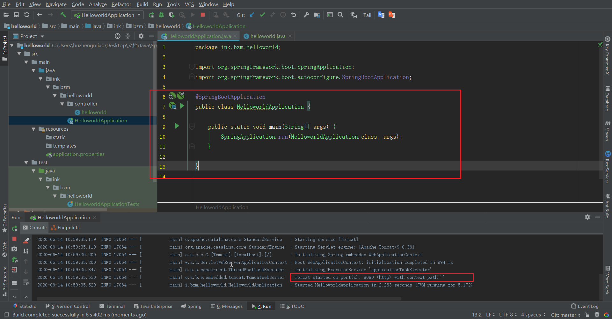


#### 6、简化部署

```xml
 <!-- 这个插件，可以将应用打包成一个可执行的jar包；-->
    <build>
        <plugins>
            <plugin>
                <groupId>org.springframework.boot</groupId>
                <artifactId>spring-boot-maven-plugin</artifactId>
            </plugin>
        </plugins>
    </build>
```

将这个应用打成`jar`包，直接使用`java -jar`的命令进行执行；

### 2.2、POM文件

#### 父项目

```xml
<parent>
    <groupId>org.springframework.boot</groupId>
    <artifactId>spring-boot-starter-parent</artifactId>
    <version>2.3.1.RELEASE</version>
    <relativePath/> <!-- lookup parent from repository -->
</parent>

它的父项目
<parent>
    <groupId>org.springframework.boot</groupId>
    <artifactId>spring-boot-dependencies</artifactId>
    <version>2.3.1.RELEASE</version>
</parent>
<!--他来真正管理Spring Boot应 用里面的所有依赖版本-->
```

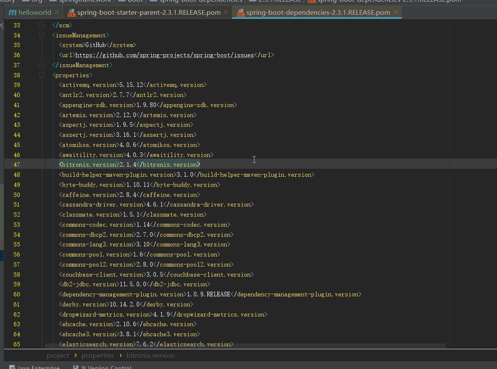

>   `Spring Boot`的版本仲裁中心,以后导入依赖，默认是不需要写版本的

#### 启动器

```xml
<dependency>
    <groupId>org.springframework.boot</groupId>
    <artifactId>spring-boot-starter-web</artifactId>
</dependency>
```

>   **spring-boot-starter**-**web**：
>
>   ​	`spring-boot-starter`：`spring-boot`场景启动器；帮我们导入了`web`模块正常运行所依赖的组件；

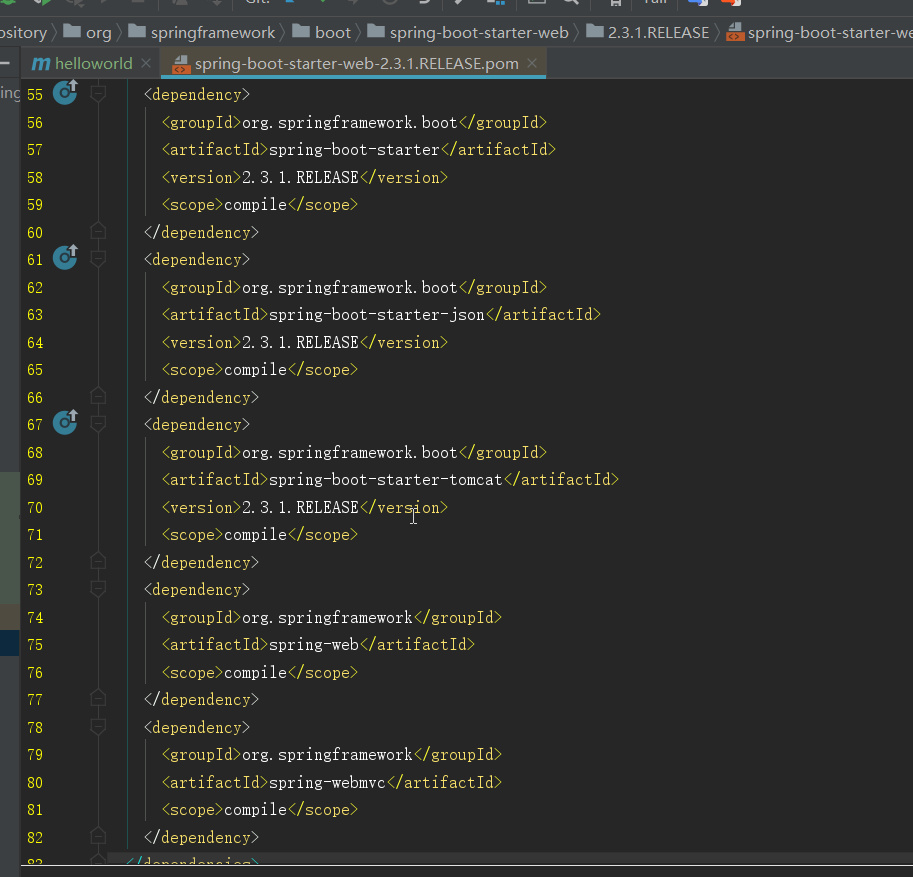

>   `SpringBoot`将所有的功能场景都抽取出来，做成一个个的`starter `**（启动器）**，只需要在项目中引入这些`starter`即可，所有相关的依赖都会导入进来 ， 我们**要用什么功能就导入什么样的场景启动器**即可 ；我们未来也可以自己自定义 `starter`；

### 2.3、主启动类

```java
@SpringBootApplication
public class HelloworldApplication {

    public static void main(String[] args) {
        SpringApplication.run(HelloworldApplication.class, args);
    }

}
```

**<u>@SpringBootApplication</u>**

**作用：**标注在某个类上说明这个类是`SpringBoot`的**主配置类** ， `SpringBoot`就应该运行这个类的`main`方法来启动`SpringBoot`应用；

```java
//进入这个注解
@Target(ElementType.TYPE)
@Retention(RetentionPolicy.RUNTIME)
@Documented
@Inherited
@SpringBootConfiguration 
@EnableAutoConfiguration
@ComponentScan(excludeFilters = { @Filter(type = FilterType.CUSTOM, classes = TypeExcludeFilter.class),
		@Filter(type = FilterType.CUSTOM, classes = AutoConfigurationExcludeFilter.class) })
public @interface SpringBootApplication {
```

<u>**@SpringBootConfiguration**</u>

**作用：**`SpringBoot`的配置类 ，标注在某个类上 ， 表示这是一个`SpringBoot`的配置类；

```java
@Target(ElementType.TYPE)
@Retention(RetentionPolicy.RUNTIME)
@Documented
@Configuration	//配置
public @interface SpringBootConfiguration {
```

​		@**Configuration**:配置类上来标注这个注解；

​			配置类 -----  配置文件；配置类也是容器中的一个组件；`@Component`


**<u>@EnableAutoConfiguration</u>**

**作用：**开启自动配置功能

>   以前我们需要自己配置的东西，而现在`SpringBoot`可以自动帮我们配置 ；`@EnableAutoConfiguration`告诉`SpringBoot`开启自动配置功能，这样自动配置才能生效；

```java
// 进入这个注解
@Target(ElementType.TYPE)
@Retention(RetentionPolicy.RUNTIME)
@Documented
@Inherited
@AutoConfigurationPackage
@Import(AutoConfigurationImportSelector.class)
public @interface EnableAutoConfiguration {
```

**<u>@AutoConfigurationPackage：自动配置包</u>**

```java
@Import(AutoConfigurationPackages.Registrar.class)
public @interface AutoConfigurationPackage {
```

>   **@import** ：`Spring`底层注解@import ， 给容器中导入一个组件
>
>   `Registrar.class` 作用：**将主启动类的所在包及包下面所有子包**里面的所有组件扫描到`Spring`容器 ；

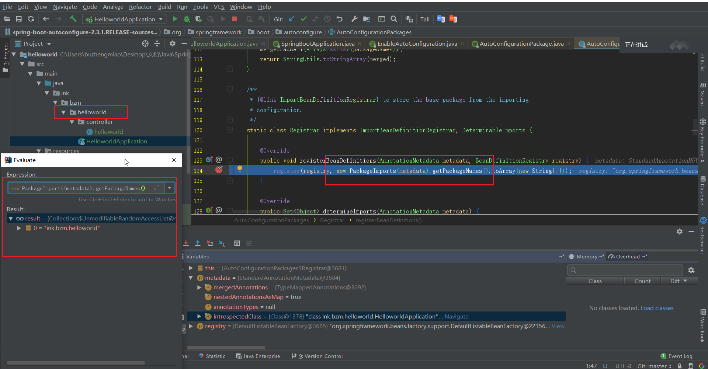

**@Import({AutoConfigurationImportSelector.class}) ：给容器导入组件 ;**

>   `AutoConfigurationImportSelector `：自动配置导入选择器，

将所有需要导入的组件以全类名的方式返回；这些组件就会被添加到容器中；

​		会给容器中导入非常多的自动配置类（xxxAutoConfiguration）；就是给容器中导入这个场景需要的所有组件，并配置好这些组件；		

**有了自动配置类，免去了我们手动编写配置注入功能组件等的工作；**

​		SpringFactoriesLoader.loadFactoryNames(EnableAutoConfiguration.class,classLoader)；


`Spring Boot`在启动的时候从类路径下的`META-INF/spring.factories`中获取`EnableAutoConfiguration`指定的值，**将这些值作为自动配置类导入到容器中**，自动配置类就生效，帮我们进行自动配置工作；以前我们需要自己配置的东西，自动配置类都帮我们；

## 3、Spring Boot配置

### 3.1、配置文件

`SpringBoot`使用一个全局的配置文件，**配置文件名是固定的**；

-   application.properties

-   application.yml

>   配置文件的作用：修改`SpringBoot`自动配置的默认值；`SpringBoot`在底层都给我们自动配置好；

`YAML`是 `"YAML Ain't a Markup Language" `（`YAML`不是一种标记语言）的递归缩写。在开发的这种语言时，`YAML` 的意思其实是：`"Yet Another Markup Language"`（仍是一种标记语言）

**这种语言以数据作为中心，而不是以标记语言为重点！**

`YAML`：配置例子

```yaml
server:
  port: 8081
```

`XML`：

```xml
<server>
	<port>8081</port>
</server>
```

### 3.2、YAML语法：

#### 基本语法

>   k:(空格)v：表示一对键值对（空格必须有）；

以**空格**的缩进来控制层级关系；只要是左对齐的一列数据，都是同一个层级的

```yaml
server:
    port: 8081
    path: /hello
```

属性和值也是大小写敏感；

#### 值的写法

**字面量：普通的值（数字，字符串，布尔）**

​	k: v：字面直接来写；

​		字符串默认不用加上单引号或者双引号；

​		""：双引号；不会转义字符串里面的特殊字符；特殊字符会作为本身想表示的意思

​				name:   "zhangsan \n lisi"：输出；zhangsan 换行  lisi

​		''：单引号；会转义特殊字符，特殊字符最终只是一个普通的字符串数据

​				name:   ‘zhangsan \n lisi’：输出；zhangsan \n  lisi

**对象、Map（属性和值）（键值对）：**

​	k: v：在下一行来写对象的属性和值的关系；注意缩进

​		对象还是k: v的方式

```yaml
friends:
		lastName: zhangsan
		age: 20
```

行内写法：

```yaml
friends: {lastName: zhangsan,age: 18}
```

**数组（List、Set）：**

用- 值表示数组中的一个元素

```yaml
pets:
 - cat
 - dog
 - pig
```

行内写法

```yaml
pets: [cat,dog,pig]
```

### 3.3、配置文件值注入

#### 配置文件

```yaml
person:
  name: qianzai
  age: 3
  happy: false
  birth: 2000/01/01
  maps: {k1: v1,k2: v2}
  lists:
    - code
    - girl
    - music
  dog:
    name: 旺财
    age: 1
```

#### javaBean

```java
/**
 * 将配置文件中配置的每一个属性的值，映射到这个组件中
 * @ConfigurationProperties：告诉SpringBoot将本类中的所有属性和配置文件中相关的配置进行绑定；
 *      prefix = "person"：配置文件中哪个下面的所有属性进行一一映射
 *
 * 只有这个组件是容器中的组件，才能容器提供的@ConfigurationProperties功能；
 *
 */
@Component
@ConfigurationProperties(prefix = "person")		//默认是全局配置文件,application.yml
public class Person {

    private String lastName;
    private Integer age;
    private Boolean boss;
    private Date birth;

    private Map<String,Object> maps;
    private List<Object> lists;
    private Dog dog;

```

我们可以导入配置文件处理器，以后编写配置就有提示了

```xml
<!--导入配置文件处理器，配置文件进行绑定就会有提示-->
		<dependency>
			<groupId>org.springframework.boot</groupId>
			<artifactId>spring-boot-configuration-processor</artifactId>
			<optional>true</optional>
		</dependency>
```

#### 测试

```java
@Autowired
Person person; //将person自动注入进来


@Test
public void contextLoads() {
    System.out.println(person); //打印person信息
}
```


#### @Value获取值和@ConfigurationProperties获取值比较

|                      | @ConfigurationProperties | @Value     |
| -------------------- | ------------------------ | ---------- |
| 功能                 | 批量注入配置文件中的属性 | 一个个指定 |
| 松散绑定（松散语法） | 支持                     | 不支持     |
| SpEL                 | 不支持                   | 支持       |
| JSR303数据校验       | 支持                     | 不支持     |
| 复杂类型封装         | 支持                     | 不支持     |

配置文件`yml`还是`properties`他们都能获取到值；

如果说，我们只是在某个业务逻辑中需要获取一下配置文件中的某项值，使用`@Value`；

如果说，我们专门编写了一个`javaBean`来和配置文件进行映射，我们就直接使用`@ConfigurationProperties`；

### 3.4、加载指定的配置文件

#### @PropertySource

>   加载指定的配置文件；

实体类

```java
@Component //注册bean
@PropertySource(value = "classpath:user.properties")	//加载指定的配置文件
public class User {
    @Value("${name}")
    private String name;
    @Value("${age}")
    private int age;
    @Value("${sex}")
    private String sex;
```

user.properties

```properties
name=qianzai
age=18
sex="男"
```

测试

```java
@Autowired
User user;

@Test
public void contextLoads() {
    System.out.println(user);
```

#### @ImportResource：

>   导入Spring的配置文件，让配置文件里面的内容生效；

`Spring Boot`里面没有`Spring`的配置文件，我们自己编写的配置文件，也不能自动识别；

想让`Spring`的配置文件生效，加载进来；@**ImportResource**标注在一个配置类上

```java
@ImportResource(locations = {"classpath:beans.xml"})
导入Spring的配置文件让其生效
```

#### @Bean

>   将方法的返回值添加到容器中；**容器中这个组件默认的id就是方法名**

```java
@Configuration
public class MyConfig {

    @Bean
    public HelloService helloService() {
        return new HelloService();
    }

}
```

### 3.5、配置文件占位符

#### 随机数

```properties
${random.value}、${random.int}、${random.long}
${random.int(10)}、${random.int[1024,65536]}
```

#### 占位符

>   获取之前配置的值，如果没有可以是用:指定默认值

```properties
person.last-name=张三${random.uuid}
person.age=${random.int}
person.birth=2017/12/15
person.boss=false
person.maps.k1=v1
person.maps.k2=14
person.lists=a,b,c
person.dog.name=${person.hello:hello}_dog 	#如果person.hello值不存在，默认使用:后面的值
person.dog.age=15
```

### 3.6、Profile

#### 1、多Profile文件

我们在主配置文件编写的时候，文件名可以是   `application-{profile}.properties/yml`

默认使用`application.properties`的配置；

#### 2、yml支持多文档块方式

```yml
server:
  port: 8081
spring:
  profiles:
    active: prod

---
server:
  port: 8083
spring:
  profiles: dev


---

server:
  port: 8084
spring:
  profiles: prod  #指定属于哪个环境
```


#### 3、激活指定profile

​	1、在配置文件中指定 ` spring.profiles.active=dev`

​	2、命令行：

```shell
java -jar spring-boot-02-config-0.0.1-SNAPSHOT.jar --spring.profiles.active=dev；
```

​		可以直接在测试的时候，配置传入命令行参数

​	3、虚拟机参数；

```shell
-Dspring.profiles.active=dev
```


### 3.7、配置文件加载位置

`springboot `启动会扫描以下位置的`application.properties`或者`application.yml`文件作为`Spring boot`的默认配置文件

–file:./config/

–file:./

–classpath:/config/

–classpath:/

优先级由高到低，高优先级的配置会覆盖低优先级的配置；

`SpringBoot`会从这四个位置全部加载主配置文件；**互补配置**；

>   我们还可以通过`spring.config.location`来改变默认的配置文件位置

### 3.8、外部配置加载顺序

>   `SpringBoot`也可以从以下位置加载配置； 优先级从高到低；高优先级的配置覆盖低优先级的配置，所有的配置会形成**互补配置**

[参考官方文档](https://docs.spring.io/spring-boot/docs/2.2.5.RELEASE/reference/htmlsingle/#boot-features-external-config)

1、命令行参数

```shell
java -jar spring-boot-02-config-02-0.0.1-SNAPSHOT.jar --server.port=8087  --server.context-path=/abc
```

2.来自`java:comp/env`的`JNDI`属性

3.`Java`系统属性（`System.getProperties()`）

4.操作系统环境变量

5.`RandomValuePropertySource`配置的`random.*`属性值

>   ==**由jar包外向jar包内进行寻找；**==
>
>   ==**优先加载带profile**==

6.jar包外部的application-{profile}.properties或application.yml(带spring.profile)配置文件

7.jar包内部的application-{profile}.properties或application.yml(带spring.profile)配置文件

8.jar包外部的application.properties或application.yml(不带spring.profile)配置文件

9.jar包内部的application.properties或application.yml(不带spring.profile)配置文件


10.`@Configuration`注解类上的`@PropertySource`

11.通过`SpringApplication.setDefaultProperties`指定的默认属性

---

### 3.9、自动配置

#### 配置文件能写什么？

[配置文件能配置的属性参照](https://docs.spring.io/spring-boot/docs/1.5.9.RELEASE/reference/htmlsingle/#common-application-properties)


#### 自动配置原理

[自动配置原理](https://juejin.im/post/5ca4e19b51882543d3780464)

[雷丰阳SpringBoot自动配置讲解](https://www.bilibili.com/video/BV1Et411Y7tQ?p=18)

 1、`SpringBoot`启动的时候**加载主配置类**，开启了自动配置功能 ==@EnableAutoConfiguration==

```java
@SpringBootApplication
public class HelloworldApplication {

    public static void main(String[] args) {
        SpringApplication.run(HelloworldApplication.class, args);
    }

}
```

>   进入` @SpringBootApplication`

```java
@Target(ElementType.TYPE)
@Retention(RetentionPolicy.RUNTIME)
@Documented
@Inherited
@SpringBootConfiguration
@EnableAutoConfiguration	//开启自动配置
@ComponentScan(excludeFilters = { @Filter(type = FilterType.CUSTOM, classes = TypeExcludeFilter.class),
		@Filter(type = FilterType.CUSTOM, classes = AutoConfigurationExcludeFilter.class) })
public @interface SpringBootApplication {
```

2、再进入 `@EnableAutoConfiguration `源码，发现最重要的就是 `@Import(AutoConfigurationImportSelector.class)` 这个注解，其中的 `AutoConfigurationImportSelector `类的作用就是往 `Spring `容器中导入组件

```java
@Target(ElementType.TYPE)
@Retention(RetentionPolicy.RUNTIME)
@Documented
@Inherited
@AutoConfigurationPackage
@Import(AutoConfigurationImportSelector.class)
public @interface EnableAutoConfiguration {
```

>   进入这个类的源码，发现有这几个方法

```java
/**
* 方法用于给容器中导入组件
**/
@Override
public String[] selectImports(AnnotationMetadata annotationMetadata) {
    if (!isEnabled(annotationMetadata)) {
        return NO_IMPORTS;
    }
    AutoConfigurationMetadata autoConfigurationMetadata = AutoConfigurationMetadataLoader
        .loadMetadata(this.beanClassLoader);
    AutoConfigurationEntry autoConfigurationEntry = getAutoConfigurationEntry(
        autoConfigurationMetadata, annotationMetadata);  // 获取自动配置项
    return StringUtils.toStringArray(autoConfigurationEntry.getConfigurations());
}

// 获取自动配置项
protected AutoConfigurationEntry getAutoConfigurationEntry(
    AutoConfigurationMetadata autoConfigurationMetadata,
    AnnotationMetadata annotationMetadata) {
    if (!isEnabled(annotationMetadata)) {
        return EMPTY_ENTRY;
    }
    AnnotationAttributes attributes = getAttributes(annotationMetadata);
    List < String > configurations = getCandidateConfigurations(annotationMetadata,
        attributes);  //  获取一个自动配置 List ，这个 List 就包含了所有自动配置的类名
    configurations = removeDuplicates(configurations);
    Set < String > exclusions = getExclusions(annotationMetadata, attributes);
    checkExcludedClasses(configurations, exclusions);
    configurations.removeAll(exclusions);
    configurations = filter(configurations, autoConfigurationMetadata);
    fireAutoConfigurationImportEvents(configurations, exclusions);
    return new AutoConfigurationEntry(configurations, exclusions);
}

//   获取一个自动配置 List ，这个 List 就包含了所有的自动配置的类名
protected List < String > getCandidateConfigurations(AnnotationMetadata metadata,
    AnnotationAttributes attributes) {
    // 通过 getSpringFactoriesLoaderFactoryClass 获取默认的 EnableAutoConfiguration.class 类名，传入 loadFactoryNames 方法
    List < String > configurations = SpringFactoriesLoader.loadFactoryNames(
        getSpringFactoriesLoaderFactoryClass(), getBeanClassLoader());
    Assert.notEmpty(configurations,
        "No auto configuration classes found in META-INF/spring.factories. If you " +
        "are using a custom packaging, make sure that file is correct.");
    return configurations;
}

// 默认的 EnableAutoConfiguration.class 类名
protected Class<?> getSpringFactoriesLoaderFactoryClass() {
	return EnableAutoConfiguration.class;
}
```

>     获取一个自动配置 `List `，这个 `List `就包含了所有自动配置的类名
>
>     ```java
>     List<String> configurations = getCandidateConfigurations(annotationMetadata, attributes);
>     ```

跳转到`getCandidateConfigurations()`方法 

```java
	protected List<String> getCandidateConfigurations(AnnotationMetadata metadata, AnnotationAttributes attributes) {
		List<String> configurations = SpringFactoriesLoader.loadFactoryNames(getSpringFactoriesLoaderFactoryClass(),
				getBeanClassLoader());
		Assert.notEmpty(configurations, "No auto configuration classes found in META-INF/spring.factories. If you "
				+ "are using a custom packaging, make sure that file is correct.");
		return configurations;
	}
```

3、进入`SpringFactoriesLoader`的`loadFactoryNames`方法，`loadSpringFactories `方法发现 `ClassLoader `类加载器指定了一个 **FACTORIES_RESOURCE_LOCATION** 常量。

```java
public static List < String > loadFactoryNames(Class < ? > factoryClass, @Nullable ClassLoader classLoader) {
    String factoryClassName = factoryClass.getName();
    return loadSpringFactories(classLoader).getOrDefault(factoryClassName, Collections.emptyList());
}

private static Map < String, List < String >> loadSpringFactories(@Nullable ClassLoader classLoader) {
    MultiValueMap < String, String > result = cache.get(classLoader);
    if (result != null) {
        return result;
    }

    try {
        // 扫描所有 jar 包类路径下  META-INF/spring.factories
        Enumeration < URL > urls = (classLoader != null ?
            classLoader.getResources(FACTORIES_RESOURCE_LOCATION) :
            ClassLoader.getSystemResources(FACTORIES_RESOURCE_LOCATION));
        result = new LinkedMultiValueMap < > ();
        while (urls.hasMoreElements()) {
            URL url = urls.nextElement();
            UrlResource resource = new UrlResource(url);
            // 把扫描到的这些文件的内容包装成 properties 对象
            Properties properties = PropertiesLoaderUtils.loadProperties(resource);
            for (Map.Entry < ? , ? > entry : properties.entrySet()) {
                String factoryClassName = ((String) entry.getKey()).trim();
                for (String factoryName: StringUtils.commaDelimitedListToStringArray((String) entry.getValue())) {
                    // 从 properties 中获取到 EnableAutoConfiguration.class 类（类名）对应的值，然后把他们添加在容器中
                    result.add(factoryClassName, factoryName.trim());
                }
            }
        }
        cache.put(classLoader, result);
        return result;
    } catch (IOException ex) {
        throw new IllegalArgumentException("Unable to load factories from location [" +
            FACTORIES_RESOURCE_LOCATION + "]", ex);
    }
}
```

>   然后利用`PropertiesLoaderUtils `把 `ClassLoader `扫描到的这些文件的内容包装成 `properties` 对象，从 `properties `中获取到 `EnableAutoConfiguration.class` 类（类名）对应的值，然后把他们添加在容器中。

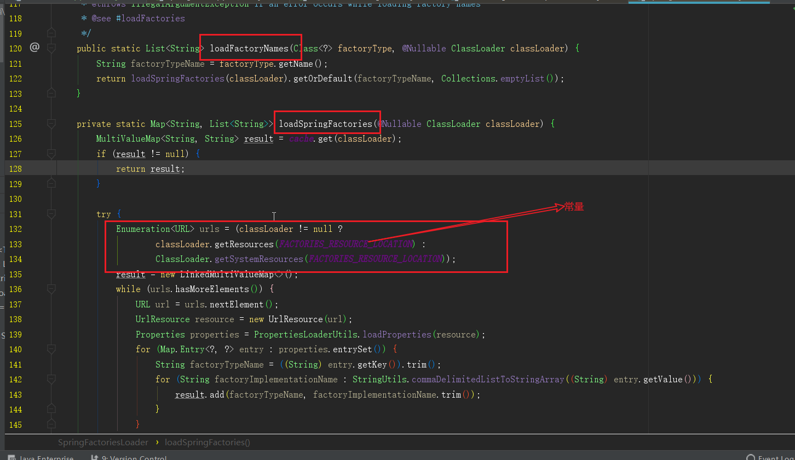

```java
public static final String FACTORIES_RESOURCE_LOCATION = "META-INF/spring.factories";
```


4、将类路径下 `META-INF/spring.factories `里面配置的所有 `EnableAutoConfiguration `的值加入到了容器中

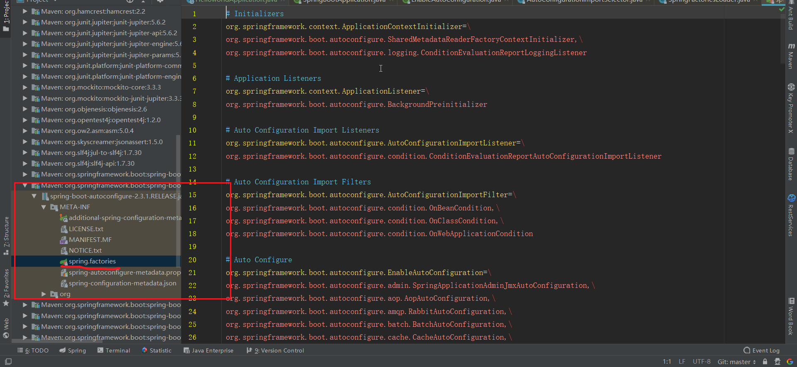

每一个这样的 `xxxAutoConfiguration `类都是容器中的一个组件，都加入到容器中，用他们来做自动配置。上述的每一个自动配置类都有自动配置功能，也可在配置文件中自定义配置。

#### 举例说明 Http 编码自动配置原理

```java
@Configuration 
// 表示这是一个配置类，以前编写的配置文件一样，也可以给容器中添加组件

@EnableConfigurationProperties(ServerProperties.class)  
// 启动指定类的 ConfigurationProperties 功能；将配置文件中对应的值和 ServerProperties 绑定起来；并把 ServerProperties 加入到 ioc 容器中

@ConditionalOnWebApplication 
// Spring 底层 @Conditional 注解，根据不同的条件，如果满足指定的条件，整个配置类里面的配置就会生效；判断当前应用是否是 web 应用，如果是，当前配置类生效

@ConditionalOnClass(CharacterEncodingFilter.class) 
// 判断当前项目有没有这个类 CharacterEncodingFilter；SpringMVC 中进行乱码解决的过滤器；

@ConditionalOnProperty(prefix = "spring.http.encoding", value = "enabled", matchIfMissing = true) 
// 判断配置文件中是否存在某个配置  spring.http.encoding.enabled；如果不存在，判断也是成立的
// 即使我们配置文件中不配置 pring.http.encoding.enabled=true，也是默认生效的；
public class HttpEncodingAutoConfiguration {

    // 已经和 SpringBoot 的配置文件建立映射关系了
    private final ServerProperties properties;

    //只有一个有参构造器的情况下，参数的值就会从容器中拿
    public HttpEncodingAutoConfiguration(ServerProperties properties) {
        this.properties = properties;
    }

    @Bean 
    // 给容器中添加一个组件，这个组件的某些值需要从 properties 中获取
    @ConditionalOnMissingBean(CharacterEncodingFilter.class) 
    public CharacterEncodingFilter characterEncodingFilter() {
        CharacterEncodingFilter filter = new OrderedCharacterEncodingFilter();
        filter.setEncoding(this.properties.getCharset().name());
        filter.setForceRequestEncoding(this.properties.shouldForce(Type.REQUEST));
        filter.setForceResponseEncoding(this.properties.shouldForce(Type.RESPONSE));
        return filter;
    }
```

>   所有在配置文件中能配置的属性都是在 `xxxxProperties `类中封装的；配置文件能配置什么就可以参照某个功能对应的这个属性类


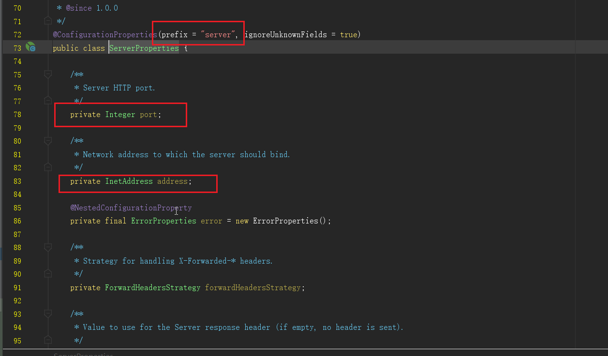

```markdown
# 然后里面的属性都是，可以在配置文件中指定的。前缀就是server。
```

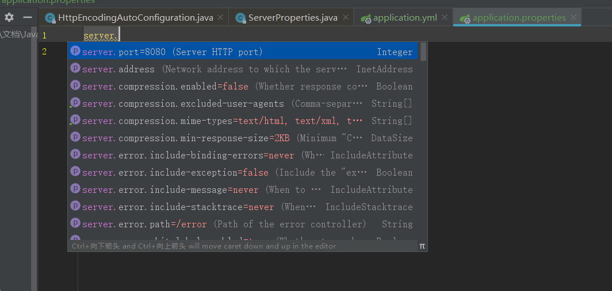

#### 总结

**1）、SpringBoot启动会加载大量的自动配置类**

**2）、我们看我们需要的功能有没有SpringBoot默认写好的自动配置类；**

**3）、我们再来看这个自动配置类中到底配置了哪些组件；（只要我们要用的组件有，我们就不需要再来配置了）**

**4）、给容器中自动配置类添加组件的时候，会从properties类中获取某些属性。我们就可以在配置文件中指定这些属性的值；**


xxxxAutoConfigurartion：自动配置类；

给容器中添加组件

xxxxProperties:封装配置文件中相关属性；

---

### 3.10、@Conditional派生注解

>   （Spring注解版原生的@Conditional作用）

作用：必须是@Conditional指定的条件成立，才给容器中添加组件，配置配里面的所有内容才生效；

| @Conditional扩展注解            | 作用（判断是否满足当前指定条件）                 |
| ------------------------------- | ------------------------------------------------ |
| @ConditionalOnJava              | 系统的java版本是否符合要求                       |
| @ConditionalOnBean              | 容器中存在指定Bean；                             |
| @ConditionalOnMissingBean       | 容器中不存在指定Bean；                           |
| @ConditionalOnExpression        | 满足SpEL表达式指定                               |
| @ConditionalOnClass             | 系统中有指定的类                                 |
| @ConditionalOnMissingClass      | 系统中没有指定的类                               |
| @ConditionalOnSingleCandidate   | 容器中只有一个指定的Bean，或者这个Bean是首选Bean |
| @ConditionalOnProperty          | 系统中指定的属性是否有指定的值                   |
| @ConditionalOnResource          | 类路径下是否存在指定资源文件                     |
| @ConditionalOnWebApplication    | 当前是web环境                                    |
| @ConditionalOnNotWebApplication | 当前不是web环境                                  |
| @ConditionalOnJndi              | JNDI存在指定项                                   |

### 3.11、判断配置文件生效

我们怎么知道哪些自动配置类生效；

**==我们可以通过启用  debug=true属性；来让控制台打印自动配置报告==**，这样我们就可以很方便的知道哪些自动配置类生效；

```java
=========================
AUTO-CONFIGURATION REPORT
=========================


Positive matches:（自动配置类启用的）
-----------------

   DispatcherServletAutoConfiguration matched:
      - @ConditionalOnClass found required class 'org.springframework.web.servlet.DispatcherServlet'; @ConditionalOnMissingClass did not find unwanted class (OnClassCondition)
      - @ConditionalOnWebApplication (required) found StandardServletEnvironment (OnWebApplicationCondition)
        
    
Negative matches:（没有启动，没有匹配成功的自动配置类）
-----------------

   ActiveMQAutoConfiguration:
      Did not match:
         - @ConditionalOnClass did not find required classes 'javax.jms.ConnectionFactory', 'org.apache.activemq.ActiveMQConnectionFactory' (OnClassCondition)

   AopAutoConfiguration:
      Did not match:
         - @ConditionalOnClass did not find required classes 'org.aspectj.lang.annotation.Aspect', 'org.aspectj.lang.reflect.Advice' (OnClassCondition)
        
```

## 4、SpringBoot与日志

### 4.1、市面上的日志框架

`JUL`、`JCL`、`Jboss-logging`、`logback`、`log4j`、`log4j2`、`slf4j....`

| 日志门面  （日志的抽象层）                                   | 日志实现                                             |
| ------------------------------------------------------------ | ---------------------------------------------------- |
| ~~JCL（Jakarta  Commons Logging）~~    SLF4j（Simple  Logging Facade for Java）    **~~jboss-logging~~** | Log4j  JUL（java.util.logging）  Log4j2  **Logback** |

>   -   底层是`Spring`框架，`Spring`框架默认是用`JCL`；
>
>   -   `SpringBoot`选用 `SLF4j`和`logback`；

#### 4.2、SLF4j使用

[SLF4j](https://www.slf4j.org)

>   开发的时候，日志记录方法的调用，不应该来直接调用日志的实现类，而是**调用日志抽象层里面的方法**；
>
>   给系统里面导入`slf4j`的`jar`和  `logback`的实现`jar`

```java
import org.slf4j.Logger;
import org.slf4j.LoggerFactory;

public class HelloWorld {
  public static void main(String[] args) {
    Logger logger = LoggerFactory.getLogger(HelloWorld.class);
    logger.info("Hello World");
  }
}
```

图示；


#### 4.3、统一日志记录

>   开发时候，可能用到很多框架，底层适配的日志系统可能不一样，如果进行统一呢？
>
>   `a（slf4j+logback）: Spring（commons-logging）、Hibernate（jboss-logging）、MyBatis、xxxx`

*统一日志记录，即使是别的框架和我一起统一使用slf4j进行输出？*


**如何让系统中所有的日志都统一到slf4j；**

==1、将系统中其他日志框架先排除出去；==

==2、用中间包来替换原有的日志框架；==

==3、我们导入slf4j其他的实现==

```xml
<dependency>
    <groupId>org.springframework.boot</groupId>
    <artifactId>spring-boot-starter-logging</artifactId>
    <version>2.3.1.RELEASE</version>
    <scope>compile</scope>
</dependency>
```

#### 4.4、SpringBoot日志使用

##### 1、默认配置

`SpringBoot`默认帮我们配置好了日志,**直接使用即可**；

>   `spring-boot-starter`中已经导入了

```java
//记录器
Logger logger = LoggerFactory.getLogger(getClass());
@Test
public void contextLoads() {
    //System.out.println();

    //日志的级别；
    //由低到高   trace<debug<info<warn<error
    //可以调整输出的日志级别；日志就只会在这个级别以以后的高级别生效
    logger.trace("这是trace日志...");
    logger.debug("这是debug日志...");
    //SpringBoot默认给我们使用的是info级别的，没有指定级别的就用SpringBoot默认规定的级别；root级别
    logger.info("这是info日志...");
    logger.warn("这是warn日志...");
    logger.error("这是error日志...");
}
```

`application.properties`

```properties
logging.level.ink.bzm.springboot=trace

#logging.path=
# 不指定路径在当前项目下生成springboot.log日志
# 可以指定完整的路径；
#logging.file=G:/springboot.log

# 在当前磁盘的根路径下创建spring文件夹和里面的log文件夹；使用 spring.log 作为默认文件
logging.path=/spring/log

#  在控制台输出的日志的格式
logging.pattern.console=%d{yyyy-MM-dd} [%thread] %-5level %logger{50} - %msg%n
# 指定文件中日志输出的格式
logging.pattern.file=%d{yyyy-MM-dd} === [%thread] === %-5level === %logger{50} ==== %msg%n
```

[logback日志配置文件](../资料/logback.xml)

```properties
    日志输出格式：
		%d表示日期时间，
		%thread表示线程名，
		%-5level：级别从左显示5个字符宽度
		%logger{50} 表示logger名字最长50个字符，否则按照句点分割。 
		%msg：日志消息，
		%n是换行符
    -->
    %d{yyyy-MM-dd HH:mm:ss.SSS} [%thread] %-5level %logger{50} - %msg%n
```

| logging.file | logging.path | Example  | Description                        |
| ------------ | ------------ | -------- | ---------------------------------- |
| (none)       | (none)       |          | 只在控制台输出                     |
| 指定文件名   | (none)       | my.log   | 输出日志到my.log文件               |
| (none)       | 指定目录     | /var/log | 输出到指定目录的 spring.log 文件中 |

##### 2、指定配置

给类路径下放上每个日志框架自己的配置文件即可；`SpringBoot`就不使用他默认配置的了

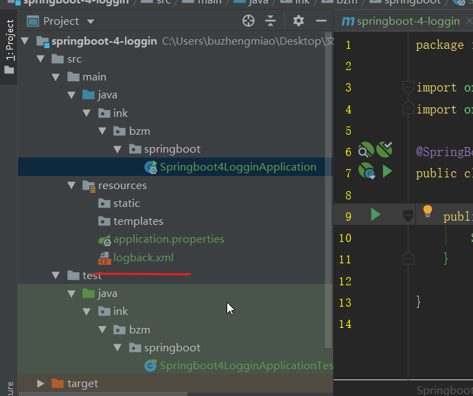

| Logging System          | Customization                                                |
| ----------------------- | ------------------------------------------------------------ |
| Logback                 | `logback-spring.xml`, `logback-spring.groovy`, `logback.xml` or `logback.groovy` |
| Log4j2                  | `log4j2-spring.xml` or `log4j2.xml`                          |
| JDK (Java Util Logging) | `logging.properties`                                         |

**logback.xml**：直接就被日志框架识别了；

**logback-spring.xml**：日志框架就不直接加载日志的配置项，由`SpringBoot`解析日志配置，可以使用`SpringBoot`的高级`Profile`功能

```xml
<springProfile name="dev">
    <!-- configuration to be enabled when the "staging" profile is active -->
  	可以指定某段配置只在某个环境下生效
</springProfile>
```

如：

```xml
<appender name="stdout" class="ch.qos.logback.core.ConsoleAppender">
    <!--
        日志输出格式：
   %d表示日期时间，
   %thread表示线程名，
   %-5level：级别从左显示5个字符宽度
   %logger{50} 表示logger名字最长50个字符，否则按照句点分割。 
   %msg：日志消息，
   %n是换行符
        -->
    <layout class="ch.qos.logback.classic.PatternLayout">
        <springProfile name="dev">
            <pattern>%d{yyyy-MM-dd HH:mm:ss.SSS} ----> [%thread] ---> %-5level %logger{50} - %msg%n</pattern>
        </springProfile>
        <springProfile name="!dev">
            <pattern>%d{yyyy-MM-dd HH:mm:ss.SSS} ==== [%thread] ==== %-5level %logger{50} - %msg%n</pattern>
        </springProfile>
    </layout>
</appender>
```

>   如果使用`logback.xml`作为日志配置文件，还要使用`profile`功能，会有以下错误
>
>   `no applicable action for [springProfile]`

##### 3、切换日志框架


---


### 5、SpringBoot与Web

#### 5.1、简介

#### 5.2、静态资源映射

##### 5.2.1、规则

1、所有的`webjars`，都去` classpath:/META-INF/resources/webjars/` 找资源；

​	`webjars`：以`jar`包的方式引入静态资源；

[WebJars官网](https://www.webjars.org/)

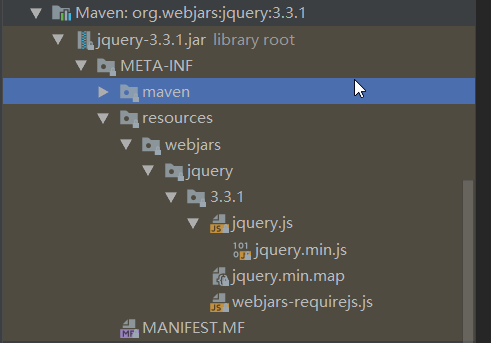

示例：

```xml
<!--引入jquery-->
<dependency>
    <groupId>org.webjars</groupId>
    <artifactId>jquery</artifactId>
    <version>3.3.1</version>
</dependency>
```

运行访问：`localhost:8080/webjars/jquery/3.3.1/jquery.js`


2、`"/**"`：访问当前项目的任何资源（静态资源文件夹）

```java
"classpath:/META-INF/resources/", 
"classpath:/resources/",
"classpath:/static/", 
"classpath:/public/" 
"/"：当前项目的根路径
```

>   **注意**
>
>   静态资源加载不出来，可以重启下`maven`


3、`WelcomePage`欢迎页，首页

```markdown
- 静态资源文件夹下的所有index.html页面；
```

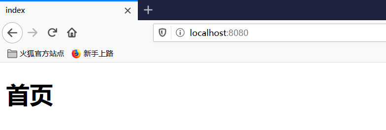

4、网页图标

```markdown
- 所有的 **/favicon.ico  都是在静态资源文件下找；
```


##### 5.2.2、原理

`WebMvc`自动配置:`WebMvcAutoConfiguration`

```java
@ConfigurationProperties(prefix = "spring.resources", ignoreUnknownFields = false)
public class ResourceProperties {
    //可以设置和静态资源有关的参数，缓存时间等
```

`WebMvcAuotConfiguration`

```java
		@Override
		public void addResourceHandlers(ResourceHandlerRegistry registry) {
			if (!this.resourceProperties.isAddMappings()) {
				logger.debug("Default resource handling disabled");
				return;
			}
			Integer cachePeriod = this.resourceProperties.getCachePeriod();
			if (!registry.hasMappingForPattern("/webjars/**")) {
				customizeResourceHandlerRegistration(
						registry.addResourceHandler("/webjars/**")
								.addResourceLocations(
										"classpath:/META-INF/resources/webjars/")
						.setCachePeriod(cachePeriod));
			}
			String staticPathPattern = this.mvcProperties.getStaticPathPattern();
          	//静态资源文件夹映射
			if (!registry.hasMappingForPattern(staticPathPattern)) {
				customizeResourceHandlerRegistration(
						registry.addResourceHandler(staticPathPattern)
								.addResourceLocations(
										this.resourceProperties.getStaticLocations())
						.setCachePeriod(cachePeriod));
			}
		}

        //配置欢迎页映射
		@Bean
		public WelcomePageHandlerMapping welcomePageHandlerMapping(
				ResourceProperties resourceProperties) {
			return new WelcomePageHandlerMapping(resourceProperties.getWelcomePage(),
					this.mvcProperties.getStaticPathPattern());
		}

       //配置喜欢的图标
		@Configuration
		@ConditionalOnProperty(value = "spring.mvc.favicon.enabled", matchIfMissing = true)
		public static class Favic onConfiguration {

			private final ResourceProperties resourceProperties;

			public FaviconConfiguration(ResourceProperties resourceProperties) {
				this.resourceProperties = resourceProperties;
			}

			@Bean
			public SimpleUrlHandlerMapping faviconHandlerMapping() {
				SimpleUrlHandlerMapping mapping = new SimpleUrlHandlerMapping();
				mapping.setOrder(Ordered.HIGHEST_PRECEDENCE + 1);
              	//所有  **/favicon.ico 
				mapping.setUrlMap(Collections.singletonMap("**/favicon.ico",
						faviconRequestHandler()));
				return mapping;
			}

			@Bean
			public ResourceHttpRequestHandler faviconRequestHandler() {
				ResourceHttpRequestHandler requestHandler = new ResourceHttpRequestHandler();
				requestHandler
						.setLocations(this.resourceProperties.getFaviconLocations());
				return requestHandler;
			}

		}
```

##### 5.2.3、自定义静态资源映射文件夹

```properties
spring.resources.static-locations=classpath:/hello/
```

>   自定义之后，默认的将不生效。


#### 5.3、模板引擎

模板引擎（这里特指用于`Web`开发的模板引擎）是为了使用户界面与业务数据（内容）分离而产生的，它可以生成特定格式的文档，用于网站的模板引擎就会生成一个标准的文档。

`JSP`、`Velocity`、`Freemarker`、`Thymeleaf`


`SpringBoot`推荐的`Thymeleaf`；

语法更简单，功能更强大；


#### 5.4、Thymeleaf使用

引入`thymeleaf`

```xml
<!--引入thymeleaf-->
<dependency>
    <groupId>org.springframework.boot</groupId>
    <artifactId>spring-boot-starter-thymeleaf</artifactId>
</dependency>
```

##### 1、Thymeleaf语法

[Thymeleaf语法文档](https://www.thymeleaf.org/doc/tutorials/3.0/usingthymeleaf.html)

```java
@ConfigurationProperties(prefix = "spring.thymeleaf")
public class ThymeleafProperties {

	private static final Charset DEFAULT_ENCODING = StandardCharsets.UTF_8;

	public static final String DEFAULT_PREFIX = "classpath:/templates/";

	public static final String DEFAULT_SUFFIX = ".html";
```

>   只要我们把`HTML`页面放在`classpath:/templates/`，`thymeleaf`就能自动渲染；

1、导入`thymeleaf`的名称空间

```xml
<html lang="en" xmlns:th="http://www.thymeleaf.org">
```

2、使用`thymeleaf`语法；

```html
<!DOCTYPE html>
<html lang="en" xmlns:th="http://www.thymeleaf.org">
<head>
    <meta charset="UTF-8">
    <title>success</title>
</head>
<body> 
    <h1>成功！</h1>
    <!--th:text 将div里面的文本内容设置为 -->
    <div th:text="${hello}">这是显示欢迎信息</div>
</body>
</html>
```


##### 2、Thymeleaf映射

>   **classpath:/templates/**
>
>   `ThymeleafProperties`查看
>
>   ```java
>   	/**
>   	 * Prefix that gets prepended to view names when building a URL.
>   	 */
>   	private String prefix = DEFAULT_PREFIX;
>   
>   public static final String DEFAULT_PREFIX = "classpath:/templates/";
>   ```
>
>   


```java
    //查出用户数据，在页面展示
    @RequestMapping("/success")
    public String success(Map<String, Object> map) {
        return "success";	//templates/success
    }
```


#### 5.5、SpringMVC自动配置

[Spring MVC auto-configuration](https://docs.spring.io/spring-boot/docs/1.5.10.RELEASE/reference/htmlsingle/#boot-features-spring-mvc-auto-configuration)

[B站雷丰阳老师讲解](https://www.bilibili.com/video/BV1Et411Y7tQ?t=634&p=31)

[Spring MVC 自动配置原理解析](https://juejin.im/post/5e84c1186fb9a03c7e2007b8)

`Spring Boot`为`Spring MVC`提供了自动配置，可以很好地与大多数应用程序一起工作。

以下是`SpringBoot`对`SpringMVC`的默认配置:

-   Inclusion of `ContentNegotiatingViewResolver` and `BeanNameViewResolver` beans.
-   Support for serving static resources, including support for WebJars (covered [later in this document](https://docs.spring.io/spring-boot/docs/2.2.5.RELEASE/reference/htmlsingle/#boot-features-spring-mvc-static-content))).
-   Automatic registration of `Converter`, `GenericConverter`, and `Formatter` beans.
-   Support for `HttpMessageConverters` (covered [later in this document](https://docs.spring.io/spring-boot/docs/2.2.5.RELEASE/reference/htmlsingle/#boot-features-spring-mvc-message-converters)).
-   Automatic registration of `MessageCodesResolver` (covered [later in this document](https://docs.spring.io/spring-boot/docs/2.2.5.RELEASE/reference/htmlsingle/#boot-features-spring-message-codes)).
-   Static `index.html` support.
-   Custom `Favicon` support (covered [later in this document](https://docs.spring.io/spring-boot/docs/2.2.5.RELEASE/reference/htmlsingle/#boot-features-spring-mvc-favicon)).
-   Automatic use of a `ConfigurableWebBindingInitializer` bean (covered [later in this document](https://docs.spring.io/spring-boot/docs/2.2.5.RELEASE/reference/htmlsingle/#boot-features-spring-mvc-web-binding-initializer)).


##### 5.5.1、SpringMVC扩展配置

**示例：**

```java
//使用WebMvcConfigurerAdapter可以来扩展SpringMVC的功能
@Configuration
public class MyMvcConfig implements WebMvcConfigurer {
    @Override
    public void addViewControllers(ViewControllerRegistry registry) {
        //浏览器发送 /atguigu 请求来到 success
        registry.addViewController("/abc").setViewName("success");
    }
}
```

>   原理：
>
>   ​	1）、`WebMvcAutoConfiguration`是`SpringMVC`的自动配置类
>
>   ​	2）、在做其他自动配置时会导入；@Import(**EnableWebMvcConfiguration**.class)
>
>   ```java
>   @Configuration(proxyBeanMethods = false)
>   public static class EnableWebMvcConfiguration extends DelegatingWebMvcConfiguration implements ResourceLoaderAware {
>   
>      //DelegatingWebMvcConfiguration父类
>      
>      private final WebMvcConfigurerComposite configurers = new WebMvcConfigurerComposite();
>   
>      //从容器中获取所有的WebMvcConfigurer
>   	@Autowired(required = false)
>   	public void setConfigurers(List<WebMvcConfigurer> configurers) {
>   		if (!CollectionUtils.isEmpty(configurers)) {
>   			this.configurers.addWebMvcConfigurers(configurers);
>   		}
>   	}
>      
>      //一个参考实现；addViewControllers
>      @Override
>   	public void addViewControllers(ViewControllerRegistry registry) {
>   		for (WebMvcConfigurer delegate : this.delegates) {
>   			delegate.addViewControllers(registry);
>   		}
>   	}
>   
>   ```
>
>   ​	3）、容器中所有的`WebMvcConfigurer`都会一起起作用；
>
>   ​	4）、我们的配置类也会被调用；
>
>   ​	**效果：**`SpringMVC`的自动配置和我们的扩展配置都会起作用；


##### 5.5.2、全面接管SpringMVC

`SpringBoot`对`SpringMVC`的自动配置不需要了，所有都是我们自己配置；所有的`SpringMVC`的自动配置都失效了。

**我们需要在配置类中添加@EnableWebMvc即可；**

```java
//使用WebMvcConfigurerAdapter可以来扩展SpringMVC的功能
@Configuration
@EnableWebMvc   //全面接管SpringMVC
public class MyMvcConfig implements WebMvcConfigurer {
    /**
     * 添加视图控制器
     * @param registry
     */
    @Override
    public void addViewControllers(ViewControllerRegistry registry) {
        //浏览器发送 /atguigu 请求来到 success
        registry.addViewController("/abc").setViewName("success");
    }
}
```

>   **原理：**
>
>   为什么`@EnableWebMvc`自动配置就失效了；
>
>   1）`@EnableWebMvc`的核心
>
>   ```java
>   @Import(DelegatingWebMvcConfiguration.class)
>   public @interface EnableWebMvc {
>   ```
>
>   2）、
>
>   ```java
>   @Configuration
>   public class DelegatingWebMvcConfiguration extends WebMvcConfigurationSupport {
>   ```
>
>   3）、
>
>   ```java
>   @Configuration
>   @ConditionalOnWebApplication
>   @ConditionalOnClass({ Servlet.class, DispatcherServlet.class,
>   		WebMvcConfigurerAdapter.class })
>   //容器中没有这个组件的时候，这个自动配置类才生效
>   @ConditionalOnMissingBean(WebMvcConfigurationSupport.class)
>   @AutoConfigureOrder(Ordered.HIGHEST_PRECEDENCE + 10)
>   @AutoConfigureAfter({ DispatcherServletAutoConfiguration.class,
>   		ValidationAutoConfiguration.class })
>   public class WebMvcAutoConfiguration {
>   ```
>
>   4）、`@EnableWebMvc`将`WebMvcConfigurationSupport`组件导入进来；
>
>   5）、导入的`WebMvcConfigurationSupport`只是`SpringMVC`最基本的功能；


#### 5.6、如何修改SpringBoot的默认配置

 **模式：**

​	1）、`SpringBoot`在自动配置很多组件的时候，先看容器中有没有用户自己配置的（`@Bean`、`@Component`）如果有就用用户配置的，如果没有，才自动配置；如果有些组件可以有多个（`ViewResolver`）将用户配置的和自己默认的组合起来；

​	2）、在`SpringBoot`中会有非常多的`xxxConfigurer`帮助我们进行扩展配置

​	3）、在`SpringBoot`中会有很多的`xxxCustomizer`帮助我们进行定制配置


#### 5.7、RestfulCRUD案例

##### 1、默认访问首页

```java
//MyMvcConfig.java 

	//所有的WebMvcConfigurerAdapter组件都会一起起作用
    @Bean //将组件注册在容器
    public WebMvcConfigurerAdapter webMvcConfigurerAdapter(){
        WebMvcConfigurerAdapter adapter = new WebMvcConfigurerAdapter() {
            @Override
            public void addViewControllers(ViewControllerRegistry registry) {
                registry.addViewController("/").setViewName("login");
                registry.addViewController("/index.html").setViewName("login");
            }

        };
        return adapter;
    }
```


##### 2、资源引入

使用`Thymeleaf`模板引擎，控制资源

```html
<!-- Bootstrap core CSS -->
		<link href="asserts/css/bootstrap.min.css" th:href="@{/webjars/bootstrap/4.0.0/css/bootstrap.css}" rel="stylesheet">
		<!-- Custom styles for this template -->
		<link href="asserts/css/signin.css" th:href="@{/asserts/css/signin.css}" rel="stylesheet">


```

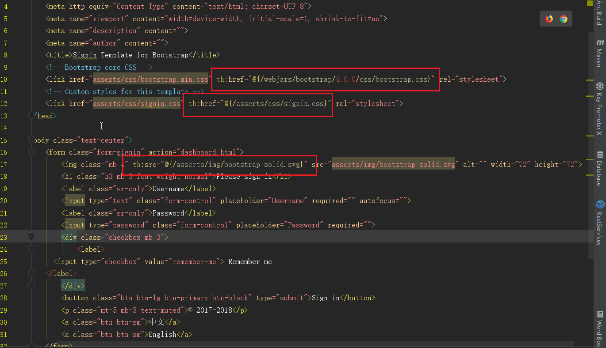


##### 3、国际化

**1）、编写国际化配置文件；**

2）、使用`ResourceBundleMessageSource`管理国际化资源文件

3）、在页面使用fmt:message取出国际化内容

###### 步骤一：编写国际化配置文件

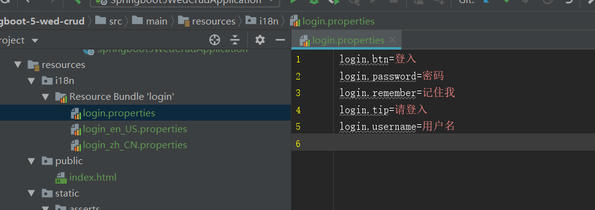

`SpringBoot`自动配置好了管理国际化资源文件的组件

```java
//MessageSourceAutoConfiguration
	@Bean
	@ConfigurationProperties(prefix = "spring.messages")
	public MessageSourceProperties messageSourceProperties() {
		return new MessageSourceProperties();
	}
//进入MessageSourceProperties
public class MessageSourceProperties {

	/**
	 * Comma-separated list of basenames (essentially a fully-qualified classpath
	 * location), each following the ResourceBundle convention with relaxed support for
	 * slash based locations. If it doesn't contain a package qualifier (such as
	 * "org.mypackage"), it will be resolved from the classpath root.
	 */
	private String basename = "messages";
     //我们的配置文件可以直接放在类路径下叫messages.properties；
```

```java
@Bean
    public MessageSource messageSource(MessageSourceProperties properties) {
        ResourceBundleMessageSource messageSource = new ResourceBundleMessageSource();
        if (StringUtils.hasText(properties.getBasename())) {
             //设置国际化资源文件的基础名（去掉语言国家代码的）
            messageSource.setBasenames(StringUtils
                                       .commaDelimitedListToStringArray(StringUtils.trimAllWhitespace(properties.getBasename())));
        }
        if (properties.getEncoding() != null) {
            messageSource.setDefaultEncoding(properties.getEncoding().name());
        }
        messageSource.setFallbackToSystemLocale(properties.isFallbackToSystemLocale());
        Duration cacheDuration = properties.getCacheDuration();
        if (cacheDuration != null) {
            messageSource.setCacheMillis(cacheDuration.toMillis());
        }
        messageSource.setAlwaysUseMessageFormat(properties.isAlwaysUseMessageFormat());
        messageSource.setUseCodeAsDefaultMessage(properties.isUseCodeAsDefaultMessage());
        return messageSource;
    }
```

`application.properties`设置信息来源

```properties
spring.messages.basename=i18n.login
```

###### 步骤二：去页面获取国际化的值；

```html
<body class="text-center">
		<form class="form-signin" action="dashboard.html">
			
			<h1 class="h3 mb-3 font-weight-normal" th:text="#{login.tip}">Please sign in</h1>
			<label class="sr-only" th:text="#{login.username}">Username</label>
			<input type="text" class="form-control" placeholder="Username" th:placeholder="#{login.username}" required="" autofocus="">
			<label class="sr-only" th:text="#{login.password}">Password</label>
			<input type="password" class="form-control" placeholder="Password" th:placeholder="#{login.password}" required="">
			<div class="checkbox mb-3">
				<label>
          <input type="checkbox" value="remember-me" > [[#{login.remember}]]
        </label>
			</div>
			<button class="btn btn-lg btn-primary btn-block" type="submit" th:text="#{login.btn}">Sign in</button>
			<p class="mt-5 mb-3 text-muted">© 2017-2018</p>
			<a class="btn btn-sm">中文</a>
			<a class="btn btn-sm">English</a>
		</form>

	</body>
```

**效果：根据浏览器语言设置的信息切换了国际化；**

>   **原理：**
>
>   ​			国际化`Locale`（区域信息对象）；`LocaleResolver`（获取区域信息对象）；

```java
		@Bean
		@ConditionalOnMissingBean
		@ConditionalOnProperty(prefix = "spring.mvc", name = "locale")
		public LocaleResolver localeResolver() {
            //如果有指定的，使用指定的
			if (this.mvcProperties.getLocaleResolver() == WebMvcProperties.LocaleResolver.FIXED) {
				return new FixedLocaleResolver(this.mvcProperties.getLocale());
			}
            //从请求头中拿到区域信息
			AcceptHeaderLocaleResolver localeResolver = new AcceptHeaderLocaleResolver();
			localeResolver.setDefaultLocale(this.mvcProperties.getLocale());
			return localeResolver;
		}
```

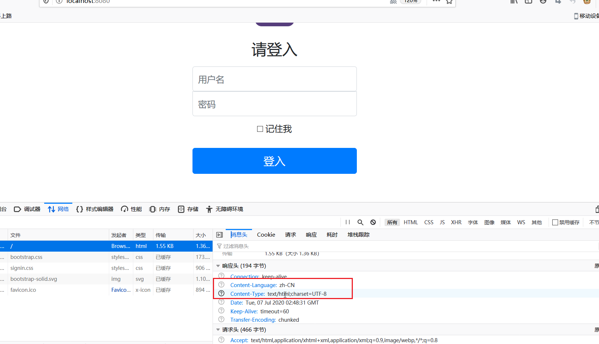

###### 步骤三：点击链接切换国际化

`MyLocaleResolver`编写`resolveLocale`

```java
/**
 * 可以在链接上携带区域信息
 */
public class MyLocaleResolver implements LocaleResolver {

    @Override
    public Locale resolveLocale(HttpServletRequest request) {
        String l = request.getParameter("l");
        Locale locale = Locale.getDefault();
        if(!StringUtils.isEmpty(l)){
            String[] split = l.split("_");
            locale = new Locale(split[0],split[1]);
        }
        return locale;
    }

    @Override
    public void setLocale(HttpServletRequest request, HttpServletResponse response, Locale locale) {

    }
}
```

`MyMvcConfig`添加`LocaleResolver`组件

```java
    @Bean
    public LocaleResolver localeResolver(){

        return new MyLocaleResolver();
    }
```

>   测试切换

##### 4、登入

修改`login.html`登录表单提交

```html
<form class="form-signin" action="dashboard.html" th:action="@{/user/login}" method="post">
```

编写登入控制器`LoginController`

```java
/**
 * 登入控制器
 */
@Controller
public class LoginController {

//    @DeleteMapping
//    @PutMapping
//    @GetMapping

    //@RequestMapping(value = "/user/login",method = RequestMethod.POST)
    @PostMapping(value = "/user/login")
    public String login(@RequestParam("username") String username,
                        @RequestParam("password") String password,
                        Map<String,Object> map, HttpSession session){
        if(!StringUtils.isEmpty(username) && "123456".equals(password)){
            //登陆成功，防止表单重复提交，可以重定向到主页
            session.setAttribute("loginUser",username);
            return "redirect:/main.html";
        }else{
            //登陆失败
            map.put("msg","用户名密码错误");
            return  "login";
        }
    }
}
```


编写登录处理程序拦截器`LoginHandlerInterceptor`

```java
/**
 * 登陆检查，
 */
public class LoginHandlerInterceptor implements HandlerInterceptor {
    //目标方法执行之前
    @Override
    public boolean preHandle(HttpServletRequest request, HttpServletResponse response, Object handler) throws Exception {
        Object user = request.getSession().getAttribute("loginUser");
        if(user == null){
            //未登陆，返回登陆页面
            request.setAttribute("msg","没有权限请先登陆");
            request.getRequestDispatcher("/index.html").forward(request,response);
            return false;
        }else{
            //已登陆，放行请求
            return true;
        }

    }

    @Override
    public void postHandle(HttpServletRequest request, HttpServletResponse response, Object handler, ModelAndView modelAndView) throws Exception {

    }

    @Override
    public void afterCompletion(HttpServletRequest request, HttpServletResponse response, Object handler, Exception ex) throws Exception {

    }
}
```

在`MyMvcConfig`添加拦截器LoginHandlerInterceptor

```java
    //所有的WebMvcConfigurerAdapter组件都会一起起作用
    @Bean //将组件注册在容器
    public WebMvcConfigurerAdapter webMvcConfigurerAdapter(){
        WebMvcConfigurerAdapter adapter = new WebMvcConfigurerAdapter() {
            @Override
            public void addViewControllers(ViewControllerRegistry registry) {
                registry.addViewController("/").setViewName("login");
                registry.addViewController("/index.html").setViewName("login");
                registry.addViewController("/main.html").setViewName("dashboard");

            }
            //添加拦截器
            @Override
            public void addInterceptors(InterceptorRegistry registry) {
                //super.addInterceptors(registry);
                //静态资源；  *.css , *.js
                //SpringBoot已经做好了静态资源映射
                registry.addInterceptor(new LoginHandlerInterceptor()).addPathPatterns("/**")
                        .excludePathPatterns("/index.html","/","/user/login");
            } 

        };
        return adapter;
    }
```

##### 5、Thymeleaf公共页面元素抽取

```html
1、抽取公共片段
<div th:fragment="copy">
&copy; 2011 The Good Thymes Virtual Grocery
</div>

2、引入公共片段
<div th:insert="~{footer :: copy}"></div>
~{templatename::#selector}：模板名::选择器
~{templatename::fragmentname}:模板名::片段名

3、默认效果：
insert的公共片段在div标签中
如果使用th:insert等属性进行引入，可以不用写~{}：
行内写法可以加上：[[~{}]];[(~{})]；
```


**三种引入公共片段的th属性：**

**th:insert**：将公共片段整个插入到声明引入的元素中

**th:replace**：将声明引入的元素替换为公共片段

**th:include**：将被引入的片段的内容包含进这个标签中


```html
<footer th:fragment="copy">
&copy; 2011 The Good Thymes Virtual Grocery
</footer>

引入方式
<div th:insert="footer :: copy"></div>
<div th:replace="footer :: copy"></div>
<div th:include="footer :: copy"></div>

效果
<div>
    <footer>
    &copy; 2011 The Good Thymes Virtual Grocery
    </footer>
</div>

<footer>
&copy; 2011 The Good Thymes Virtual Grocery
</footer>

<div>
&copy; 2011 The Good Thymes Virtual Grocery
</div>
```


##### 6、CRUD-员工列表

`Restful`风格

|      | 普通CRUD（uri来区分操作） | RestfulCRUD       |
| ---- | ------------------------- | ----------------- |
| 查询 | getEmp                    | emp---GET         |
| 添加 | addEmp?xxx                | emp---POST        |
| 修改 | updateEmp?id=xxx&xxx=xx   | emp/{id}---PUT    |
| 删除 | deleteEmp?id=1            | emp/{id}---DELETE |

实验请求架构

| 实验功能                             | 请求URI | 请求方式 |
| ------------------------------------ | ------- | -------- |
| 查询所有员工                         | emps    | GET      |
| 查询某个员工(来到修改页面)           | emp/1   | GET      |
| 来到添加页面                         | emp     | GET      |
| 添加员工                             | emp     | POST     |
| 来到修改页面（查出员工进行信息回显） | emp/1   | GET      |
| 修改员工                             | emp     | PUT      |
| 删除员工                             | emp/1   | DELETE   |


#### 5.8、错误处理机制

##### 1）、SpringBoot默认的错误处理机制

默认效果：

​		1）、浏览器，返回一个默认的错误页面


 浏览器发送请求的请求头：


​		2）、如果是其他客户端，默认响应一个json数据


​		


##### 2）、错误处理的自动配置原理

可以参照`ErrorMvcAutoConfiguration`；

步骤：

​		一但系统出现4xx或者5xx之类的错误；ErrorPageCustomizer就会生效（定制错误的响应规则）；就会来到/error请求；就会被**BasicErrorController**处理；

​		1）响应页面；去哪个页面是由**DefaultErrorViewResolver**解析得到的；

```java
	protected ModelAndView resolveErrorView(HttpServletRequest request, HttpServletResponse response, HttpStatus status,
			Map<String, Object> model) {
		for (ErrorViewResolver resolver : this.errorViewResolvers) {
			ModelAndView modelAndView = resolver.resolveErrorView(request, status, model);
			if (modelAndView != null) {
				return modelAndView;
			}
		}
		return null;
	}
```


1、`DefaultErrorAttributes`：

```java
帮我们在页面共享信息；
@Override
	public Map<String, Object> getErrorAttributes(RequestAttributes requestAttributes,
			boolean includeStackTrace) {
		Map<String, Object> errorAttributes = new LinkedHashMap<String, Object>();
		errorAttributes.put("timestamp", new Date());
		addStatus(errorAttributes, requestAttributes);
		addErrorDetails(errorAttributes, requestAttributes, includeStackTrace);
		addPath(errorAttributes, requestAttributes);
		return errorAttributes;
	}
```

2、`BasicErrorController`：处理默认/error请求

```java
	//基本错误控制器
	@Bean
	@ConditionalOnMissingBean(value = ErrorController.class, search = SearchStrategy.CURRENT)
	public BasicErrorController basicErrorController(ErrorAttributes errorAttributes,
			ObjectProvider<ErrorViewResolver> errorViewResolvers) {
		return new BasicErrorController(errorAttributes, this.serverProperties.getError(),
				errorViewResolvers.orderedStream().collect(Collectors.toList()));
	}

//处理默认/error请求
@Controller
@RequestMapping("${server.error.path:${error.path:/error}}")
public class BasicErrorController extends AbstractErrorController {
    
    ////产生html类型的数据；浏览器发送的请求来到这个方法处理
    @RequestMapping(produces = MediaType.TEXT_HTML_VALUE)
	public ModelAndView errorHtml(HttpServletRequest request, HttpServletResponse response) {
		HttpStatus status = getStatus(request);
		Map<String, Object> model = Collections
				.unmodifiableMap(getErrorAttributes(request, getErrorAttributeOptions(request, MediaType.TEXT_HTML)));
		response.setStatus(status.value());
        
         //去哪个页面作为错误页面；包含页面地址和页面内容
		ModelAndView modelAndView = resolveErrorView(request, response, status, model);
		return (modelAndView != null) ? modelAndView : new ModelAndView("error", model);
	}

    //产生json数据，其他客户端来到这个方法处理；
	@RequestMapping
	public ResponseEntity<Map<String, Object>> error(HttpServletRequest request) {
		HttpStatus status = getStatus(request);
		if (status == HttpStatus.NO_CONTENT) {
			return new ResponseEntity<>(status);
		}
		Map<String, Object> body = getErrorAttributes(request, getErrorAttributeOptions(request, MediaType.ALL));
		return new ResponseEntity<>(body, status);
	}
    
```

>   通过浏览器的请求头识别`text/html`

3、`ErrorPageCustomizer`：

```java
	//错误页面定制器
	@Bean
	public ErrorPageCustomizer errorPageCustomizer(DispatcherServletPath dispatcherServletPath) {
		return new ErrorPageCustomizer(this.serverProperties, dispatcherServletPath);
	}


	/**
	 * {@link WebServerFactoryCustomizer} that configures the server's error pages.
	 */
	static class ErrorPageCustomizer implements ErrorPageRegistrar, Ordered {

		private final ServerProperties properties;

		private final DispatcherServletPath dispatcherServletPath;

		protected ErrorPageCustomizer(ServerProperties properties, DispatcherServletPath dispatcherServletPath) {
			this.properties = properties;
			this.dispatcherServletPath = dispatcherServletPath;
		}

        //注册错误页面
		@Override
		public void registerErrorPages(ErrorPageRegistry errorPageRegistry) {
			ErrorPage errorPage = new ErrorPage(
                /*发生错误后去哪个路径 
                	@Value("${error.path:/error}")
					private String path = "/error";
                */
		this.dispatcherServletPath.getRelativePath(this.properties.getError().getPath()));
			errorPageRegistry.addErrorPages(errorPage);
		}

		@Override
		public int getOrder() {
			return 0;
		}

	}
```

4、`DefaultErrorViewResolver`：

```java                                                       
@Override
	public ModelAndView resolveErrorView(HttpServletRequest request, HttpStatus status,
			Map<String, Object> model) {
		ModelAndView modelAndView = resolve(String.valueOf(status), model);
		if (modelAndView == null && SERIES_VIEWS.containsKey(status.series())) {
			modelAndView = resolve(SERIES_VIEWS.get(status.series()), model);
		}
		return modelAndView;
	}

	private ModelAndView resolve(String viewName, Map<String, Object> model) {
        //默认SpringBoot可以去找到一个页面？  error/404
		String errorViewName = "error/" + viewName;
        
        //模板引擎可以解析这个页面地址就用模板引擎解析
		TemplateAvailabilityProvider provider = this.templateAvailabilityProviders
				.getProvider(errorViewName, this.applicationContext);
		if (provider != null) {
            //模板引擎可用的情况下返回到errorViewName指定的视图地址
			return new ModelAndView(errorViewName, model);
		}
        //模板引擎不可用，就在静态资源文件夹下找errorViewName对应的页面   error/404.html
		return resolveResource(errorViewName, model);
	}
```


##### 3）、如果定制错误响应

-   如何定制错误的页面;
-   如何定制错误的`json`数据;

###### 1、如何定制错误的页面；

​			**1）、有模板引擎的情况下；error/状态码;** 【将错误页面命名为  错误状态码.html 放在模板引擎文件夹里面的 error文件夹下】，发生此状态码的错误就会来到  对应的页面；

​			我们可以使用`4xx`和`5xx`作为错误页面的文件名来匹配这种类型的所有错误，**精确优先**（优先寻找精确的`状态码.html`）；		

​			页面能获取的信息；

​				`timestamp`：时间戳

​				`status`：状态码

​				`error`：错误提示

​				`exception`：异常对象

​				`message`：异常消息

​				`errors`：`JSR303`数据校验的错误都在这里

```html
<h1>status:[[${status}]]</h1>
<h2>timestamp:[[${timestamp}]]</h2>			
```

​			2）、没有模板引擎（模板引擎找不到这个错误页面），静态资源文件夹下找；

​			3）、以上都没有错误页面，就是默认来到`SpringBoot`默认的错误提示页面；


###### 2、如何定制错误的json数据；

1）、自定义异常处理&返回定制`json`数据；

```java
@ControllerAdvice
public class MyExceptionHandler {

    @ResponseBody
    @ExceptionHandler(UserNotExistException.class)
    public Map<String,Object> handleException(Exception e){
        Map<String,Object> map = new HashMap<>();
        map.put("code","user.notexist");
        map.put("message",e.getMessage());
        return map;
    }
}
//没有自适应效果...浏览器客户端返回的都是json
```


2）、转发到`/error`进行自适应响应效果处理

```java
 @ExceptionHandler(UserNotExistException.class)
    public String handleException(Exception e, HttpServletRequest request){
        Map<String,Object> map = new HashMap<>();
        //传入我们自己的错误状态码  4xx 5xx，否则就不会进入定制错误页面的解析流程
        /**
         * Integer statusCode = (Integer) request
         .getAttribute("javax.servlet.error.status_code");
         */
        request.setAttribute("javax.servlet.error.status_code",500);
        map.put("code","user.notexist");
        map.put("message",e.getMessage());
        //转发到/error
        return "forward:/error";
    }
```

###### 	3）、将我们的定制数据携带出去；

出现错误以后，会来到/error请求，会被BasicErrorController处理，响应出去可以获取的数据是由getErrorAttributes得到的（是AbstractErrorController（ErrorController）规定的方法）；

​	1、完全来编写一个ErrorController的实现类【或者是编写AbstractErrorController的子类】，放在容器中；

​	2、页面上能用的数据，或者是json返回能用的数据都是通过errorAttributes.getErrorAttributes得到；

​			容器中DefaultErrorAttributes.getErrorAttributes()；默认进行数据处理的；

自定义ErrorAttributes

```java
//给容器中加入我们自己定义的ErrorAttributes
@Component
public class MyErrorAttributes extends DefaultErrorAttributes {

    @Override
    public Map<String, Object> getErrorAttributes(RequestAttributes requestAttributes, boolean includeStackTrace) {
        Map<String, Object> map = super.getErrorAttributes(requestAttributes, includeStackTrace);
        map.put("company","atguigu");
        return map;
    }
}
```

最终的效果：响应是自适应的，可以通过定制ErrorAttributes改变需要返回的内容，


#### 5.9、配置嵌入式Servlet容器

[SpringBoot嵌入式Servlet容器](https://juejin.im/post/5efb6df4e51d4534791d404d#heading-10)

##### 1、定制和修改Servlet容器的相关配置；

`SpringBoot`默认使用`Tomcat`作为嵌入式的`Servlet`容器；

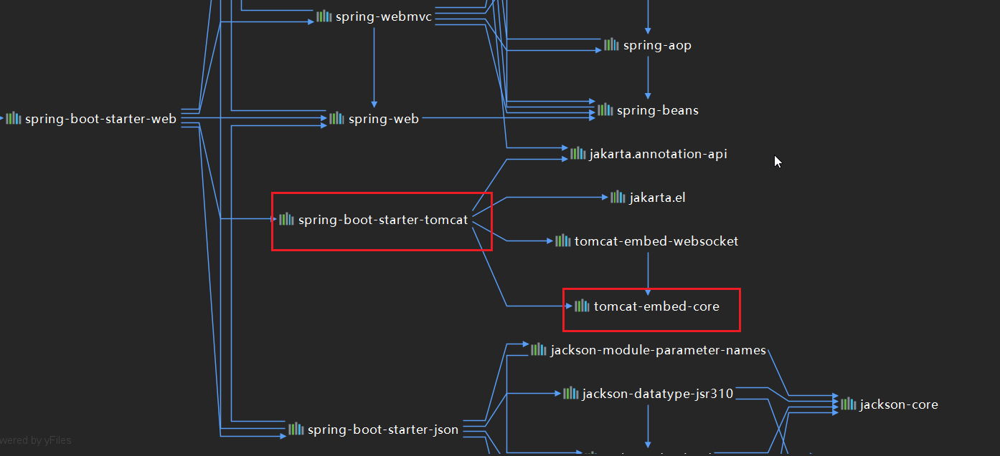

1、修改和`server`有关的配置（`ServerProperties`【也是`EmbeddedServletContainerCustomizer`】）；

```properties
server.port=8081
server.context-path=/crud

server.tomcat.uri-encoding=UTF-8

//通用的Servlet容器设置
server.xxx
//Tomcat的设置
server.tomcat.xxx
```


2、编写一个`WebServerFactoryCustomizer`：嵌入式的`Servlet`容器的定制器；来修改`Servlet`容器的配置

>   ​    注意：在`SpringBoot2.0`以上用`WebServerFactoryCustomizer`接口来定制          `EmbeddedServletContainerCustomizer`被弃置

```java
	@Bean
    public WebServerFactoryCustomizer<ConfigurableWebServerFactory> webServerFactoryCustomizer(){

        //返回一个匿名内部类形式的Servlet容器定制器
        return new WebServerFactoryCustomizer<ConfigurableWebServerFactory>(){
            //定制嵌入式的Servlet容器的相关规则。
            @Override
            public void customize(ConfigurableWebServerFactory factory) {
                factory.setPort(8088);
            }
        };
    }
```


##### 2、注册Servlet三大组件【Servlet、Filter、Listener】

>   由于`SpringBoot`默认是以`jar`包的方式启动嵌入式的`Servlet`容器来启动`SpringBoot`的`web`应用，没有`web.xml`文件。
>
>   **注册三大组件用以下方式**


`ServletRegistrationBean`

```java
@Bean
public ServletRegistrationBean myServlet(){
    ServletRegistrationBean registrationBean = new ServletRegistrationBean(new MyServlet(),"/myServlet");
    registrationBean.setLoadOnStartup(1);
    return registrationBean;
}
```

`FilterRegistrationBean`

```java
@Bean
public FilterRegistrationBean myFilter(){
    FilterRegistrationBean registrationBean = new FilterRegistrationBean();
    registrationBean.setFilter(new MyFilter());
    registrationBean.setUrlPatterns(Arrays.asList("/hello","/myServlet"));
    return registrationBean;
}
```

`ServletListenerRegistrationBean`

```java
@Bean
public ServletListenerRegistrationBean myListener(){
    ServletListenerRegistrationBean<MyListener> registrationBean = new ServletListenerRegistrationBean<>(new MyListener());
    return registrationBean;
}
```


>   `SpringBoot`帮我们自动`SpringMVC`的时候，自动的注册`SpringMVC`的前端控制器；`DIspatcherServlet`；
>
>   `DispatcherServletAutoConfiguration`中：

```java
	@Configuration(proxyBeanMethods = false)
	@Conditional(DispatcherServletRegistrationCondition.class)
	@ConditionalOnClass(ServletRegistration.class)
	@EnableConfigurationProperties(WebMvcProperties.class)
	@Import(DispatcherServletConfiguration.class)
	protected static class DispatcherServletRegistrationConfiguration {

		@Bean(name = DEFAULT_DISPATCHER_SERVLET_REGISTRATION_BEAN_NAME)
		@ConditionalOnBean(value = DispatcherServlet.class, name = DEFAULT_DISPATCHER_SERVLET_BEAN_NAME)
		public DispatcherServletRegistrationBean dispatcherServletRegistration(DispatcherServlet dispatcherServlet,
				WebMvcProperties webMvcProperties, ObjectProvider<MultipartConfigElement> multipartConfig) {
			DispatcherServletRegistrationBean registration = new DispatcherServletRegistrationBean(dispatcherServlet,
					webMvcProperties.getServlet().getPath());
              //默认拦截： /  所有请求；包静态资源，但是不拦截jsp请求；   /*会拦截jsp
    //可以通过server.servletPath来修改SpringMVC前端控制器默认拦截的请求路径
            
			registration.setName(DEFAULT_DISPATCHER_SERVLET_BEAN_NAME);
			registration.setLoadOnStartup(webMvcProperties.getServlet().getLoadOnStartup());
			multipartConfig.ifAvailable(registration::setMultipartConfig);
			return registration;
		}

	}
```


##### 3、替换为其他嵌入式Servlet容器

 以前默认使用的是`tomcat`。`SpringBoot`也支持切换：            

-   `Jetty`(适合长连接：持续的点对点连接)            
-   `Undertow`(不支持`JSP`，并发性能很好)

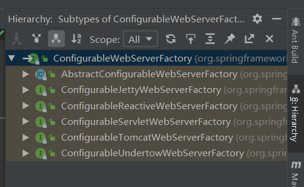

默认支持：

`Tomcat`（默认使用）

```xml
<dependency>
   <groupId>org.springframework.boot</groupId>
   <artifactId>spring-boot-starter-web</artifactId>
   引入web模块默认就是使用嵌入式的Tomcat作为Servlet容器；
</dependency>
```

`Jetty`

```xml
<!-- 引入web模块 -->
<dependency>
   <groupId>org.springframework.boot</groupId>
   <artifactId>spring-boot-starter-web</artifactId>
   <exclusions>
      <exclusion>
         <artifactId>spring-boot-starter-tomcat</artifactId>
         <groupId>org.springframework.boot</groupId>
      </exclusion>
   </exclusions>
</dependency>

<!--引入其他的Servlet容器-->
<dependency>
   <artifactId>spring-boot-starter-jetty</artifactId>
   <groupId>org.springframework.boot</groupId>
</dependency>
```

`Undertow`

```xml
<!-- 引入web模块 -->
<dependency>
   <groupId>org.springframework.boot</groupId>
   <artifactId>spring-boot-starter-web</artifactId>
   <exclusions>
      <exclusion>
         <artifactId>spring-boot-starter-tomcat</artifactId>
         <groupId>org.springframework.boot</groupId>
      </exclusion>
   </exclusions>
</dependency>

<!--引入其他的Servlet容器-->
<dependency>
   <artifactId>spring-boot-starter-undertow</artifactId>
   <groupId>org.springframework.boot</groupId>
</dependency>
```

##### 4、嵌入式Servlet容器自动配置原理；

1 、找到相关自动配置类`ServletWebServerFactoryConfiguration`：`web`服务器工厂配置类 


```java
@Configuration(proxyBeanMethods = false)
class ServletWebServerFactoryConfiguration {
	
	@Configuration(proxyBeanMethods = false)
	@ConditionalOnClass({ Servlet.class, Tomcat.class, UpgradeProtocol.class })	//判断当前是否引入了Tomcat依赖；
	@ConditionalOnMissingBean(value = ServletWebServerFactory.class, search = SearchStrategy.CURRENT)//判断当前容器没有用户自己定义ServletWebServerFactory：嵌入式的Servlet容器工厂；作用：创建嵌入式的Servlet容器
	static class EmbeddedTomcat {

		@Bean
		TomcatServletWebServerFactory tomcatServletWebServerFactory(
				ObjectProvider<TomcatConnectorCustomizer> connectorCustomizers,
				ObjectProvider<TomcatContextCustomizer> contextCustomizers,
				ObjectProvider<TomcatProtocolHandlerCustomizer<?>> protocolHandlerCustomizers) {
			TomcatServletWebServerFactory factory = new TomcatServletWebServerFactory();
			factory.getTomcatConnectorCustomizers()
					.addAll(connectorCustomizers.orderedStream().collect(Collectors.toList()));
			factory.getTomcatContextCustomizers()
					.addAll(contextCustomizers.orderedStream().collect(Collectors.toList()));
			factory.getTomcatProtocolHandlerCustomizers()
					.addAll(protocolHandlerCustomizers.orderedStream().collect(Collectors.toList()));
			return factory;
		}

	}
```

2、看一下`ServletWeb`服务器工厂：`ServletWebServerFactory`

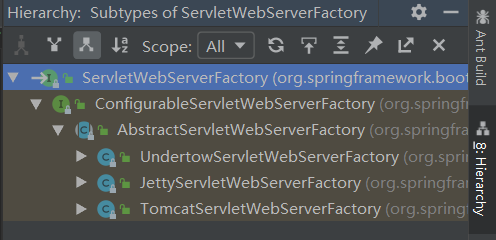

```java
@FunctionalInterface
public interface ServletWebServerFactory {
    //  getWebServer()：获得一个web服务器。
	WebServer getWebServer(ServletContextInitializer... initializers);
}
```

3、查看能获得哪些`WebServer`


4、比如导入了`Tomcat`相关依赖,分析`TomcatServletWebServerFactory`

```java
	@Configuration(proxyBeanMethods = false)
	@ConditionalOnClass({ Servlet.class, Tomcat.class, UpgradeProtocol.class })
	@ConditionalOnMissingBean(value = ServletWebServerFactory.class, search = SearchStrategy.CURRENT)
	static class EmbeddedTomcat {

		//创建Tomcat的WebServerFactory
		@Bean
		TomcatServletWebServerFactory tomcatServletWebServerFactory(
				ObjectProvider<TomcatConnectorCustomizer> connectorCustomizers,
				ObjectProvider<TomcatContextCustomizer> contextCustomizers,
				ObjectProvider<TomcatProtocolHandlerCustomizer<?>> protocolHandlerCustomizers) {
			TomcatServletWebServerFactory factory = new TomcatServletWebServerFactory();
			factory.getTomcatConnectorCustomizers()
					.addAll(connectorCustomizers.orderedStream().collect(Collectors.toList()));
			factory.getTomcatContextCustomizers()
					.addAll(contextCustomizers.orderedStream().collect(Collectors.toList()));
			factory.getTomcatProtocolHandlerCustomizers()
					.addAll(protocolHandlerCustomizers.orderedStream().collect(Collectors.toList()));
			return factory;
		}

	}
```

重写了获取`web`服务器的方法`WebServer getWebServer(ServletContextInitializer... initializers)`;

```java
	@Override
	public WebServer getWebServer(ServletContextInitializer... initializers) {
		if (this.disableMBeanRegistry) {
			Registry.disableRegistry();
		}
        //创建配置Tomcat容器
		Tomcat tomcat = new Tomcat();
		File baseDir = (this.baseDirectory != null) ? this.baseDirectory : createTempDir("tomcat");
		tomcat.setBaseDir(baseDir.getAbsolutePath());
		Connector connector = new Connector(this.protocol);
		connector.setThrowOnFailure(true);
		tomcat.getService().addConnector(connector);
		customizeConnector(connector);
		tomcat.setConnector(connector);
		tomcat.getHost().setAutoDeploy(false);
		configureEngine(tomcat.getEngine());
		for (Connector additionalConnector : this.additionalTomcatConnectors) {
			tomcat.getService().addConnector(additionalConnector);
		}
		prepareContext(tomcat.getHost(), initializers);
        //将配置好的Tomcat传入进去：调用的getTomcatWebServer方法，返回一个Tomcat服务器。
		return getTomcatWebServer(tomcat);
	}


  //得到一个Tomcat服务器：调用了tomcat的构造器。
    //this.getPort() >= 0 什么意思：这是一个布尔值。进到构造器看
    protected TomcatWebServer getTomcatWebServer(Tomcat tomcat) {
        return new TomcatWebServer(tomcat, this.getPort() >= 0, this.getShutdown());
    }
```

有`tomcat`服务器的构造方法和初始化方法`initialize()`：启动`tomcat`服务器

```java
    
    //tomcat的构造器：参数是Tomcat对象，端口大于>=0时自动启动，Shutdown对象
    public TomcatWebServer(Tomcat tomcat, boolean autoStart, Shutdown shutdown) {
        this.monitor = new Object();
        this.serviceConnectors = new HashMap();
        Assert.notNull(tomcat, "Tomcat Server must not be null");
        this.tomcat = tomcat;
        this.autoStart = autoStart;
        this.gracefulShutdown = shutdown == Shutdown.GRACEFUL ? new GracefulShutdown(tomcat) : null;
        
        //构造器调用了initialize方法
        this.initialize();
    }
    
    //initialize()方法
    private void initialize() throws WebServerException {
        logger.info("Tomcat initialized with port(s): " + this.getPortsDescription(false));
        synchronized(this.monitor) {
            try {
                this.addInstanceIdToEngineName();
                Context context = this.findContext();
                context.addLifecycleListener((event) -> {
                    if (context.equals(event.getSource()) && "start".equals(event.getType())) {
                        this.removeServiceConnectors();
                    }

                });
                //这有个很关键的启动方法：tomcat在这里启动了。
                this.tomcat.start();
                this.rethrowDeferredStartupExceptions();

                try {
                    ContextBindings.bindClassLoader(context, context.getNamingToken(), this.getClass().getClassLoader());
                } catch (NamingException var5) {
                }

                this.startDaemonAwaitThread();
            } catch (Exception var6) {
                this.stopSilently();
                this.destroySilently();
                throw new WebServerException("Unable to start embedded Tomcat", var6);
            }
        }
    }
```


##### 5、Servlet容器修改配置原理

1.  在配置文件中配置：`ServerProperties`绑定和`server`有关的配置
2.  编写一个嵌入式的`Servlet`容器定制器：`WebServerFactoryCustomize`

**分析一下Servlet容器定制器：WebServerFactoryCustomizer**

1、查看`ServletWebServerFactoryAutoConfiguration`：`web`服务器工厂自动配置类 

```java
@Configuration(proxyBeanMethods = false)
@AutoConfigureOrder(Ordered.HIGHEST_PRECEDENCE)
@ConditionalOnClass(ServletRequest.class)
@ConditionalOnWebApplication(type = Type.SERVLET)
@EnableConfigurationProperties(ServerProperties.class)
@Import({ ServletWebServerFactoryAutoConfiguration.BeanPostProcessorsRegistrar.class,
		ServletWebServerFactoryConfiguration.EmbeddedTomcat.class,
		ServletWebServerFactoryConfiguration.EmbeddedJetty.class,
		ServletWebServerFactoryConfiguration.EmbeddedUndertow.class })
public class ServletWebServerFactoryAutoConfiguration {
```

>    `BeanPostProcessorsRegistrar`：后置处理器的注册器：作用就是给`IOC`容器中导入一些组件。

2、查看`BeanPostProcessorsRegistrar`类的`registerBeanDefinitions`后置处理器注册器导入了哪些组件

```java
		@Override
		public void registerBeanDefinitions(AnnotationMetadata importingClassMetadata,
				BeanDefinitionRegistry registry) {
			if (this.beanFactory == null) {
				return;
			}
			registerSyntheticBeanIfMissing(registry, "webServerFactoryCustomizerBeanPostProcessor",
					WebServerFactoryCustomizerBeanPostProcessor.class);
			registerSyntheticBeanIfMissing(registry, "errorPageRegistrarBeanPostProcessor",
					ErrorPageRegistrarBeanPostProcessor.class);
		}
```

>    **两个重要的组件**
>
>    1.  `WebServerFactoryCustomizerBeanPostProcessor` ：`Web`服务器工厂定制器的后置处理器
>
>        作用：`bean`初始化前后（刚创建完对象，还没赋值）执行一些初始化工作
>
>    2.  `errorPageRegistrarBeanPostProcessor`

3、查看`WebServerFactoryCustomizerBeanPostProcessor`后置处理器的作用

```java
        //在初始化之前：对象创建好还没属性赋值。
        public Object postProcessBeforeInitialization(Object bean, String beanName) throws BeansException {
            //如果当前组件是一个服务器工厂类的WebServerFactory组件
            if (bean instanceof WebServerFactory) {
                //就调用下面这个方法：初始化方法
                this.postProcessBeforeInitialization((WebServerFactory)bean);
            }
            return bean;
        }
        
    //来到这个被调用的初始化方法：
    private void postProcessBeforeInitialization(WebServerFactory webServerFactory) {
        
        //第二个参数getCustomizers：得到所有的定制器
        ((Callbacks)LambdaSafe.callbacks(WebServerFactoryCustomizer.class, this.getCustomizers(), webServerFactory, new Object[0]).withLogger(WebServerFactoryCustomizerBeanPostProcessor.class)).invoke((customizer) -> {  
            //再调用每一个定制器的：customize(webServerFactory);方法。给Servlet容器进行属性赋值
            customizer.customize(webServerFactory);
        });
    }
    
    //来到第二个参数调用的方法：getCustomizers()：
    private Collection<WebServerFactoryCustomizer<?>> getCustomizers() {
        if (this.customizers == null) {
        
            //重点在这里：getWebServerFactoryCustomizerBeans()得到了一个服务器工厂定制器的Bean
            this.customizers = new ArrayList(this.getWebServerFactoryCustomizerBeans());
            this.customizers.sort(AnnotationAwareOrderComparator.INSTANCE);
            this.customizers = Collections.unmodifiableList(this.customizers);
        }

        return this.customizers;
    }
    //获取所有的服务器工厂定制器Bean所在的方法：getWebServerFactoryCustomizerBeans()
    private Collection<WebServerFactoryCustomizer<?>> getWebServerFactoryCustomizerBeans() {
    
        //从beanFactory（IOC）容器中按照类型获取服务器工厂定制器的Bean组件
        return this.beanFactory.getBeansOfType(WebServerFactoryCustomizer.class, false, false).values();
    }
```

>   1.  `WebServerFactoryCustomizer`，`Web`服务器工厂定制器有一个后置处理器：`Web`服务器工厂定制器的后置处理器：`WebServerFactoryCustomizerBeanPostProcessor`。
>   2.  `Web`服务器工厂定制器的后置处理器，`WebServerFactoryCustomizerBeanPostProcessor`来自服务器工厂自动配置类`ServletWebServerFactoryAutoConfigurationweb`导入的
>       后置处理器的注册器`BeanPostProcessorsRegistrar`。自动配置类配置了后置处理器到`IOC`中。 它的作用在`Web`服务器工厂**定制器初始化之前，创建好还没属性赋值，为期进行初始化**。
>   3.  `web`服务器工厂配置类`ServletWebServerFactoryConfiguration`,它为`SpringBoot`添加了三个服务器工厂。
>   4.  通过给容器中添加一个`WebServerFactoryCustomizer`组件，服务器工厂定制器的`Bean`组件。这样服务器工厂定制器后置处理器再为服务器工厂定制器进行初始化时，就不仅仅只拿到默认的
>       服务器工厂定制器，也会拿到我们定制的服务器工厂定制器同其他的定制器一起来给`tomcat`服务器
>       工厂类`TomcatServletWebServerFactory`初始化赋值。
>   5.  我们在自己写的服务器工厂定制器，定制`Servlet`容器的相关规则来达到我们给服务器进行配置的效果。

##### 6、嵌入式Servlet容器启动原理

>   `TomcatServletWebServerFactory：Tomcat`服务器工厂类之前说明过
>
>   什么时候创建嵌入式的`Servlet`工厂?什么时候获取嵌入式的`Servlet`容器并启动

以`Tomcat`为例， `TomcatServletWebServerFactory：Tomcat`服务器工厂类。`TomcatWebServer：Tomcat`服务器。

分别在**两个构造方法打一个端点**


`Debug`启动

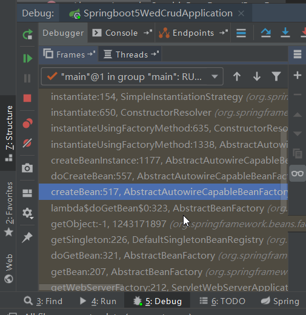


#### 5.10、使用外置的Servlet容器

[使用外置的Servlet容器](https://juejin.im/post/5efc72055188252e697dc76e)


### 6、SpringBoot与Docker


### 7、SpringBoot与数据源

#### 7.1、整合JDBC

##### 1 、SpringBoot与JDBC入门

导入`Pom`依赖

```xml
<dependency>
    <groupId>org.springframework.boot</groupId>
    <artifactId>spring-boot-starter-data-jdbc</artifactId>
</dependency>

<dependency>
    <groupId>mysql</groupId>
    <artifactId>mysql-connector-java</artifactId>
    <scope>runtime</scope>
</dependency>
```

`application.yml`

```yaml
spring:
  datasource:
    username: root
    password: 123456
    url: jdbc:mysql://192.168.200.40:3306/jdbc
    driver-class-name: com.mysql.jdbc.Driver
```

**测试**

```java
    @Autowired
    DataSource dataSource;

    @Test
    void contextLoads() throws SQLException {
//        class com.zaxxer.hikari.HikariDataSource
        System.out.println(dataSource.getClass());

        Connection connection = dataSource.getConnection();
        System.out.println(connection);
        connection.close();
    }
```

**效果：**

​	默认是用`com.zaxxer.hikari.HikariDataSource`作为数据源；

​	数据源的相关配置都在`DataSourceProperties`里面；


##### 2、自动配置原理

>   `org.springframework.boot.autoconfigure.jdbc`包下：

1、参考`DataSourceConfiguration`，根据配置创建数据源，默认使用`hikari`连接池；可以使用`spring.datasource.type`指定自定义的数据源类型；

2、`SpringBoot`默认可以支持；

```
org.apache.tomcat.jdbc.pool.DataSource、HikariDataSource、BasicDataSource、
```

3、自定义数据源类型

```java
/**
 * Generic DataSource configuration.
 */
@Configuration(proxyBeanMethods = false)
@ConditionalOnMissingBean(DataSource.class)
@ConditionalOnProperty(name = "spring.datasource.type")
static class Generic {

   @Bean
   DataSource dataSource(DataSourceProperties properties) {
      //使用DataSourceBuilder创建数据源，利用反射创建响应type的数据源，并且绑定相关属性
      return properties.initializeDataSourceBuilder().build();
   }
}
```

4、**DataSourceInitializer：ApplicationListener**；

​	作用：

​		1）、`runSchemaScripts();`运行建表语句；

​		2）、`runDataScripts()`;运行插入数据的`sql`语句；

默认只需要将文件命名为：

```properties
schema-*.sql、data-*.sql
默认规则：schema.sql，schema-all.sql；
可以使用   
	schema:
      - classpath:department.sql	#注意classpath后面没有空格
      指定位置
```

5、操作数据库：自动配置了`JdbcTemplate`操作数据库


##### 3、SpringBoot与JDBC示

```java
	@Autowired
    JdbcTemplate jdbcTemplate;

    @ResponseBody
    @GetMapping("/query")
    public Map<String,Object> map(){
        List<Map<String, Object>> list = jdbcTemplate.queryForList("select * FROM department");
        return list.get(0);
    }
```

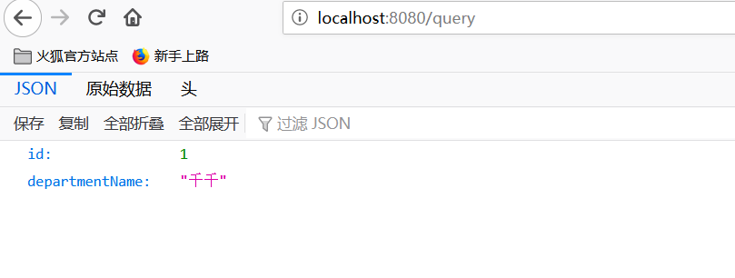

#### 7.2、整合Druid数据源

引入`pom`依赖

```xml
<!--引入druid数据源-->
<dependency>
    <groupId>com.alibaba</groupId>
    <artifactId>druid</artifactId>
    <version>1.1.19</version>
</dependency>
```

配置`application.yml`

```properties
spring:
  datasource:
    username: root
    password: 123456
    url: jdbc:mysql://192.168.200.40:3306/jdbc
    driver-class-name: com.mysql.cj.jdbc.Driver
    
    initialization-mode: always
    type: com.alibaba.druid.pool.DruidDataSource

    initialSize: 5
    minIdle: 5
    maxActive: 20
    maxWait: 60000
    timeBetweenEvictionRunsMillis: 60000
    minEvictableIdleTimeMillis: 300000
    validationQuery: SELECT 1 FROM DUAL
    testWhileIdle: true
    testOnBorrow: false
    testOnReturn: false
    poolPreparedStatements: true
    #   配置监控统计拦截的filters，去掉后监控界面sql无法统计，'wall'用于防火墙
    filters: stat,wall,log4j
    maxPoolPreparedStatementPerConnectionSize: 20
    useGlobalDataSourceStat: true
    connectionProperties: druid.stat.mergeSql=true;druid.stat.slowSqlMillis=500
```

`DruidConfig`

```java
@Configuration
public class DruidConfig {

    @ConfigurationProperties(prefix = "spring.datasource")
    @Bean
    public DataSource druid(){
       return  new DruidDataSource();
    }

    //配置Druid的监控
    //1、配置一个管理后台的Servlet
    @Bean
    public ServletRegistrationBean statViewServlet(){
        ServletRegistrationBean bean = new ServletRegistrationBean(new StatViewServlet(), "/druid/*");
        Map<String,String> initParams = new HashMap<>();

        initParams.put("loginUsername","admin");
        initParams.put("loginPassword","123456");
        initParams.put("allow","");//默认就是允许所有访问
        initParams.put("deny","192.168.15.21");

        bean.setInitParameters(initParams);
        return bean;
    }

    //2、配置一个web监控的filter
    @Bean
    public FilterRegistrationBean webStatFilter(){
        FilterRegistrationBean bean = new FilterRegistrationBean();
        bean.setFilter(new WebStatFilter());

        Map<String,String> initParams = new HashMap<>();
        initParams.put("exclusions","*.js,*.css,/druid/*");

        bean.setInitParameters(initParams);

        bean.setUrlPatterns(Arrays.asList("/*"));

        return  bean;
    }
}
```

#### 7.3、整合MyBatis

引入`pom`依赖

```xml
<!--引入mybatis依赖-->
<dependency>
    <groupId>org.mybatis.spring.boot</groupId>
    <artifactId>mybatis-spring-boot-starter</artifactId>
    <version>2.1.3</version>
</dependency>
<!--引入druid数据源-->
<dependency>
    <groupId>com.alibaba</groupId>
    <artifactId>druid</artifactId>
    <version>1.1.19</version>
</dependency>
```

配置`application.yml`

```yml
spring:
  datasource:
    username: root
    password: 123456
    url: jdbc:mysql://192.168.200.40:3306/mybatis
    driver-class-name: com.mysql.cj.jdbc.Driver
    type: com.alibaba.druid.pool.DruidDataSource
    initialization-mode: always

#    schema:
#      - classpath:sql/department.sql
#      - classpath:sql/employee.sql


    initialSize: 5
    minIdle: 5
    maxActive: 20
    maxWait: 60000
    timeBetweenEvictionRunsMillis: 60000
    minEvictableIdleTimeMillis: 300000
    validationQuery: SELECT 1 FROM DUAL
    testWhileIdle: true
    testOnBorrow: false
    testOnReturn: false
    poolPreparedStatements: true
    #   配置监控统计拦截的filters，去掉后监控界面sql无法统计，'wall'用于防火墙
    filters: stat,wall,log4j
    maxPoolPreparedStatementPerConnectionSize: 20
    useGlobalDataSourceStat: true
    connectionProperties: druid.stat.mergeSql=true;druid.stat.slowSqlMillis=500
```


### 8、SpringBoot启动配置

#### 8.1、启动配置原理

#### 8.2、自定义starter


### 9、Spring Boot与缓存


### 10、Spring Boot与消息


## 未完成...

-   [ ] [5.5、SpringMVC自动配置](# 5.5、SpringMVC自动配置)
-   [ ] [6、CRUD-员工列表](#6、CRUD-员工列表)
-   [ ] [2、如何定制错误的json数据；](#2、如何定制错误的json数据；)
-   [ ] [6、嵌入式Servlet容器启动原理](#6、嵌入式Servlet容器启动原理)
-   [ ] [7.3、整合MyBatis](#7.3、整合MyBatis)
-   [ ] [8、SpringBoot启动配置](#8、SpringBoot启动配置)


