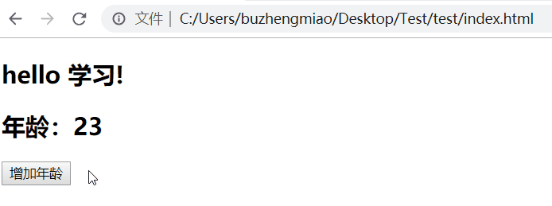
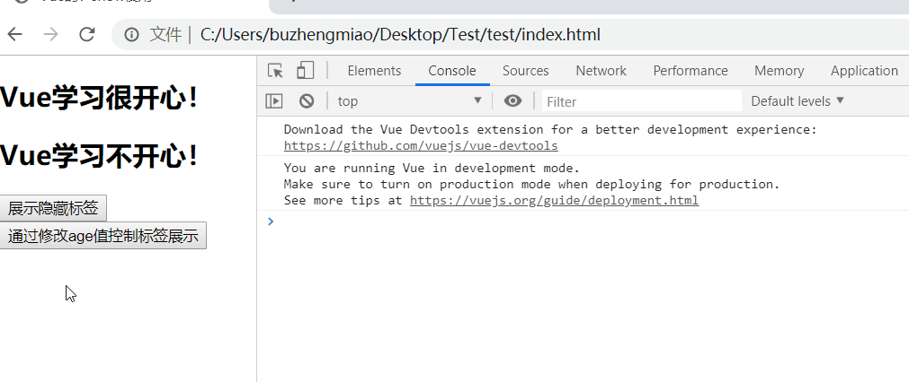
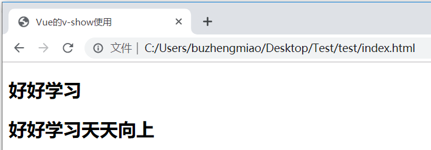
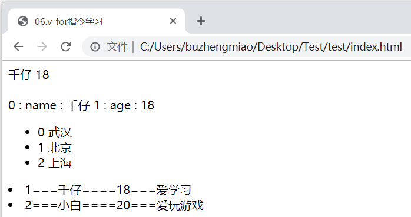

# Vue指令

!>[官方文档地址](https://cn.vuejs.org/v2/api/#%E6%8C%87%E4%BB%A4)

## v-text

!>`v-text`:用来获取`data`中数据将数据以文本的形式渲染到指定标签内部，类似于`javascript `中 `innerText`

```html
    <div id="app">
      <span>{{msg}}</span>哈哈
      <br />
      <span v-text="msg+'!'"></span> 哈哈
      <!--会覆盖原有的标签-->
    </div>

    <!--引入vue.js-->
    <script src="https://cdn.jsdelivr.net/npm/vue/dist/vue.js"></script>
    <script>
      const app = new Vue({
        el: "#app",
        data: {
          msg: "今天又是学习的一天",
        },
      });
    </script>
```


> [!tip]
>
> `{{}}`(插值表达式)和`v-text`获取数据的区别在于 
>
> - 使用v-text取值会将标签中原有的数据覆盖 使用插值表达式的形式不会覆盖标签原有的数据
> - 使用v-text可以**避免在网络环境较差的情况下出现插值闪烁**

## v-html

!>`v-html`:用来获取`data`中数据将数据中含有的`html`标签先解析在渲染到指定标签的内部，类似于`javascript`中 `innerHTML`

```html
   <div id="app">
      <span>{{msg}}</span>
      <br />
      <span v-text="msg"></span>

      <br />
      <span v-html="msg">xxxxxx</span>
    </div>

    <!--引入vue.js-->
    <script src="https://cdn.jsdelivr.net/npm/vue/dist/vue.js"></script>
    <script>
      const app = new Vue({
        el: "#app",
        data: {
          msg: "<a href=''>Vue 学习加油</a>",
        },
      });
    </script>
```


> [!tip]
>
> - 使用v-html取值会将标签中原有的数据覆盖

## v-on

### v-on:click

#### 基础语法

> 页面中提供按钮，在单击事件中修改年龄的值 同时渲染页面

```html
   <div id="app">
      <h2>{{msg}}</h2>
      <h2>年龄：{{age}}</h2>

      <input type="button" value="增加年龄" v-on:click="changeage" />
    </div>

	<!--引入vue.js-->
    <script src="https://cdn.jsdelivr.net/npm/vue/dist/vue.js"></script>
    <script>
      const app = new Vue({
        el: "#app",
        data: {
          msg: "hello 学习!",
          age: 23,
        },
        methods: {
          //methods 用来定义vue中时间
          changeage: function () {
            this.age++;
          },
        },
      });
    </script>
```



> [!tip]
>
> - 在`vue`中绑定事件是通过`v-on`指令来完成的 `v-on`:事件名 如 ` v-on:click`
> - 在`v-on:`事件名的赋值语句中是当前时间触发调用的函数名
> - 在`vue`中事件的函数统一定义在`Vue`实例的`methods`属性中
> - 在`vue`定义的事件中`this`指的就是当前的`Vue`实例,日后可以在事件中通过使用`this`获取`Vue`实例中相关数据

#### 缩写

```html
<button v-on:click="doThis"></button>
等同于

<!-- 缩写 -->
<button @click="doThis"></button>
```

**示例**：

```html
	<div id="app">
      <h2>{{ age }}</h2>
      <input type="button" value="年龄+1" v-on:click="changeage" />
      <input type="button" value="年龄-1" @click="editage" />
      <!--可以@符号形式 简化-->
    </div>

	<!--引入vue.js-->
    <script src="https://cdn.jsdelivr.net/npm/vue/dist/vue.js"></script>
    <script>
      const app = new Vue({
        el: "#app", //element: 用来指定vue作用范围
        data: {
          age: 18,
        }, //data : 用来定义vue实例中相关数据
        methods: {
          changeage: function () {
            this.age++;
          },
          editage: function () {
            this.age--;
          },
        }, //methods: 用来定义事件的处理函数
      });
    </script>
```


> [!tip]
>
> 日后在`vue`中绑定事件时可以通过`@`符号形式 简化 ` v-on` 的事件绑定

#### 传递参数

```html
    <div id="app">
      <span>{{count}}</span>
      <input
        type="button"
        value="改变count为指定的值"
        @click="changecount(23,'bzm')"
      />
    </div>

	<!--引入vue.js-->
    <script src="https://cdn.jsdelivr.net/npm/vue/dist/vue.js"></script>
    <script>
      const app = new Vue({
        el: "#app",
        data: {
          count: 1,
        },
        methods: {
          changecount(count, name) {
            this.count = count;
            alert(name);
          },
        },
      });
    </script>
```


> 在使用事件时,可以直接在事件调用出给事件进行参数传递,在事件定义出通过定义对应变量接收传递的参数

## v-show

!>`v-show`:用来控制页面中某个标签元素是否展示，底层使用控制是 `display `属性

```html
	<div id="app">
      <h2 v-show="true">Vue学习很开心！</h2>
      <h2 v-show="show">Vue学习不开心！</h2>
      <input type="button" value="展示隐藏标签" @click="showmsg" />
      <h1 v-show="age>=30">Bzm博客</h1>
      <input
        type="button"
        @click="changeAge"
        value="通过修改age值控制标签展示"
      />
    </div>
	<!--引入vue.js-->
    <script src="https://cdn.jsdelivr.net/npm/vue/dist/vue.js"></script>
    <script>
      const app = new Vue({
        el: "#app",
        data: {
          show: true,
          age: 23,
        },
        methods: {
          //定义时间
          showmsg() {
            this.show = !this.show;
          },
          changeAge() {
            this.age++;
            console.log(this.age);
          },
        },
      });
    </script>
```




---

> [!tip]
>
> - `v-show`时可以直接书写`boolean`值控制元素展示,也可以通过变量控制标签展示和隐藏
> - `v-show`中可以通过`boolean`表达式控制标签的展示课隐藏

##  v-if 

!>`v-if`: 用来控制页面元素是否展示，底层控制是DOM元素

```html
    <div id="app">
      <h2 v-if="true">好好学习</h2>
      <h2 v-if="show">好好学习天天向上</h2>
    </div>
    <!--引入vue.js-->
    <script src="https://cdn.jsdelivr.net/npm/vue/dist/vue.js"></script>
    <script>
      const app = new Vue({
        el: "#app",
        data: {
          show: true,
        },
        methods: {},
      });
    </script>
```



##  v-bind

!>`v-bind`: 用来绑定标签的属性从而通过vue动态修改标签的属性

```html
    <style>
      .aa {
        border: 2px red solid;
      }
    </style>
  </head>
  <body>
    <div id="app">
      <!--  -->
      

      <input type="button" value="动态控制加入样式" @click="addCss" />

      <input type="button" value="改变图片" @click="changeSrc" />
    </div>
    <!--引入vue.js-->
    <script src="https://cdn.jsdelivr.net/npm/vue/dist/vue.js"></script>
    <script>
      const app = new Vue({
        el: "#app",
        data: {
          msg: "随机图片!!!!",
          showCss: true,
          src: "https://api.mz-moe.cn/img.php",
        },
        methods: {
          addCss() {
            this.showCss = !this.showCss;
          },
          changeSrc() {
            this.src =
              "https://bzm.ink/upload/2021/02/d5-0a0d5ba5f0e84f4db4650b58c2f086d8.png";
          },
        },
      });
    </script>
```

`v-bind`缩写

```html
<!-- 完整语法 -->
<a v-bind:href="url">...</a>

<!-- 缩写 -->
<a :href="url">...</a>
```

## v-for

!>`v-for`: 作用就是用来对对象进行遍历的(数组也是对象的一种)

```html
    <div id="app">
      <span>{{ user.name }} {{ user.age }}</span>
      <br />
      <!-- 通过v-for遍历对象-->
      <span v-for="u in user">{{u}}</span>
      <br />
      <span v-for="(value,key,index) in user">
        {{index}} : {{key}} : {{value}}
      </span>
      <!-- 通过v-for遍历数组-->
      <ul>
        <li v-for="a,index in arr">{{index}} {{a}}</li>
      </ul>
      <!--通过v-for遍历数组中对象
    :key 便于vue内部做重用和排序
    -->
      <u1>
        <li v-for="user,index in users" :key="user.id">
          {{index+1}}==={{user.name}}===={{user.age}}==={{user.msg}}
        </li>
      </u1>
    </div>

    <!-- 开发环境版本，包含了有帮助的命令行警告 -->
    <script src="https://cdn.jsdelivr.net/npm/vue/dist/vue.js"></script>
    <script>
      const app = new Vue({
        el: "#app",
        data: {
          user: { name: "千仔", age: "18" },
          arr: ["武汉", "北京", "上海"],
          users: [
            { id: 1, name: "千仔", age: 18, msg: "爱学习" },
            { id: 2, name: "小白", age: 20, msg: "爱玩游戏" },
          ],
        },
        methods: {},
      });
    </script>
```



> [!tip]
>
> 在使用`v-for`的时候一定要注意加入:`key `用来给`vue`内部提供重用和排序的唯一`key `

## v-model 

!>`v-model`: 作用用来绑定标签元素的值与`vue`实例对象中`data`数据保持一致,从而实现双向的数据绑定机制

```html
    <div id="app">
      <input type="text" v-model="msg" />
      <br />
      <br />
      <span>{{msg}}</span>
      <hr />
      <input type="button" value="改变Data中的数据" @click="changeValue" />
    </div>

    <!-- 开发环境版本，包含了有帮助的命令行警告 -->
    <script src="https://cdn.jsdelivr.net/npm/vue/dist/vue.js"></script>
    <script>
      const app = new Vue({
        el: "#app",
        data: {
          msg: "",
        },
        methods: {
          changeValue() {
            this.msg = "Vue的双向绑定！！";
          },
        },
      });
    </script>
```


> [!tip]
>
> - 所谓**双向绑定** ，表单中数据变化导致`vue`实例`data`数据变化
> - `vue`实例中`data`数据的变化导致表单中数据变化 称之为**双向绑定**